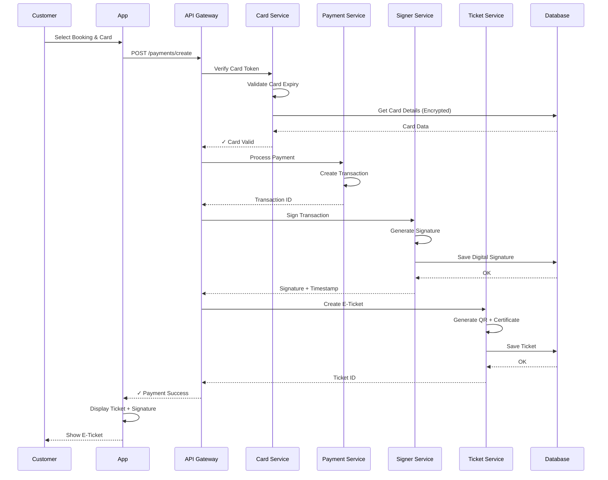
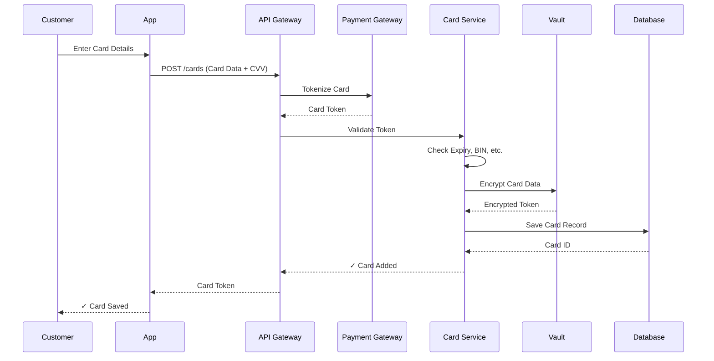

# BusZ Card System with Digital Signer - Proposal

**Version:** 1.0  
**Component:** Card Management & Digital Signature System  
**Technology:** Java/Kotlin, Spring Boot, Android  
**Document Type:** Expansion Proposal  
**Status:** Proposal  
**Author:** BusZ Development Team  
**Last Updated:** 2026-08-13

---

## 1. Executive Summary

Mục tiêu mở rộng hệ thống BusZ bằng cách thêm:

- **Card System** - Quản lý thẻ điện tử/vật lý cho khách hàng
- **Digital Signer** - Ký số các vé, giao dịch để tăng bảo mật
- **Backend Microservice** - Java/Spring Boot
- **Mobile Integration** - Kotlin cho Android app
- **Advanced Features** - E-wallet, Card Wallet, Subscription

---

## 2. Business Context

### 2.1 Current Limitation

Hệ thống BusZ hiện tại:
- Thanh toán qua gateway (VNPay, MoMo, ZaloPay)
- Vé điện tử không có chữ ký số
- Không có lịch sử thanh toán từng chi tiết
- Khách hàng phải nhập thông tin thanh toán mỗi lần

### 2.2 Proposed Solution

**Card System** cho phép:
- Khách hàng lưu thẻ thanh toán an toàn
- Thanh toán nhanh với 1 click
- Quản lý lịch sử thẻ
- Hỗ trợ gift card, loyalty card

**Digital Signer** cung cấp:
- Chứng thực vé (signature + public key)
- Xác thực giao dịch
- Audit trail không thể giả mạo
- Tuân thủ quy định pháp luật

---

## 3. Target Architecture

```
┌─────────────────────────────────────────────────────────────┐
│                    Mobile Applications                       │
│        (Flutter for iOS/Android + Kotlin Native)           │
└────────────┬────────────────────────┬──────────────────────┘
             │                        │
             │ REST API               │ WebSocket
             │                        │
┌────────────▼────────────────────────▼──────────────────────┐
│              API Gateway / Load Balancer                    │
└────────────┬───────────────────────────────────────────────┘
             │
    ┌────────▼───────────┬──────────────────┬──────────────┐
    │                    │                  │              │
┌───▼────┐  ┌────────┐ ┌─▼──────────┐ ┌───▼──────────┐ ┌──▼────┐
│ Card   │  │Payment │ │  Booking   │ │  Signer      │ │Ticket │
│Service │  │Service │ │  Service   │ │  Service     │ │Service│
│(Java)  │  │(Node.js)│ │ (Node.js)  │ │  (Java)      │ │(Node) │
└───┬────┘  └────────┘ └────────────┘ └──────────────┘ └──────┘
    │
    └──────┬──────────────────────────────────────────┐
           │                                          │
    ┌──────▼────────┐                        ┌───────▼──────┐
    │ Vault/Secure  │                        │PostgreSQL    │
    │ Storage       │                        │Database      │
    │ (Encryption)  │                        └──────────────┘
    └───────────────┘
```

---

## 4. Core Components

### 4.1 Card Service (Java Spring Boot)

**Responsibilities:**
- Quản lý card (add, update, delete, list)
- Lưu trữ card securely
- PCI DSS compliance
- Card tokenization
- Card validation

**Key Features:**
- Add Card (from payment gateway)
- Update Card Info
- Delete Card
- List User Cards
- Set Default Card
- Card Expiration Check

**Technologies:**
```
- Spring Boot 3.x
- Spring Security (JWT)
- Spring Data JPA
- Spring Vault (Secret Management)
- PostgreSQL (Card Table)
- Redis (Cache)
```

### 4.2 Digital Signer Service (Java Spring Boot)

**Responsibilities:**
- Sinh key pairs (RSA 2048/4096)
- Ký số ticket/transaction
- Verify signature
- Certificate management
- Audit trail

**Key Features:**
- Generate Digital Certificate
- Sign Ticket/Transaction
- Verify Signature
- Timestamp
- Audit Log
- Key Rotation

**Technologies:**
```
- Spring Boot 3.x
- Bouncy Castle (Cryptography)
- Java Cryptography API
- Timestamp Service
- Certificate Authority (CA)
```

### 4.3 Payment Integration

**Flow:**
```
Booking → Payment Gateway → Card Service → Signer Service → Ticket Service
```

1. Customer chọn Payment Method (Card / Wallet / Direct)
2. Card Service xác thực & authorize
3. Signer Service ký transaction
4. Payment Service xác nhận
5. Ticket Service sinh e-ticket với signature

### 4.4 Kotlin Integration (Android)

**Android App Features:**
- Biometric (Fingerprint/Face) để thanh toán
- Card management UI
- Offline signature verification
- Secure storage (Keystore)
- Push notification

---

## 5. Database Schema Enhancement

### 5.1 Card Tables

```sql
CREATE TABLE cards (
    id UUID PRIMARY KEY,
    user_id UUID NOT NULL REFERENCES users(id),
    card_token VARCHAR(255) UNIQUE,
    last_four CHAR(4),
    card_type VARCHAR(20), -- VISA, MASTERCARD, etc.
    issuer VARCHAR(50),
    expiry_month INT,
    expiry_year INT,
    is_default BOOLEAN,
    is_active BOOLEAN,
    encrypted_data TEXT, -- Encrypted full card info
    created_at TIMESTAMP,
    updated_at TIMESTAMP,
    deleted_at TIMESTAMP,
    FOREIGN KEY (user_id) REFERENCES users(id)
);

CREATE TABLE card_transactions (
    id UUID PRIMARY KEY,
    card_id UUID NOT NULL REFERENCES cards(id),
    booking_id UUID NOT NULL REFERENCES bookings(id),
    amount DECIMAL(12,2),
    currency VARCHAR(3),
    status VARCHAR(20), -- PENDING, SUCCESS, FAILED
    transaction_reference VARCHAR(255),
    response_data JSONB,
    created_at TIMESTAMP,
    updated_at TIMESTAMP
);

CREATE TABLE card_wallets (
    id UUID PRIMARY KEY,
    user_id UUID NOT NULL REFERENCES users(id),
    balance DECIMAL(12,2),
    last_updated TIMESTAMP,
    FOREIGN KEY (user_id) REFERENCES users(id)
);
```

### 5.2 Signer Tables

```sql
CREATE TABLE user_certificates (
    id UUID PRIMARY KEY,
    user_id UUID NOT NULL REFERENCES users(id),
    certificate_data TEXT, -- PEM format
    public_key TEXT,
    private_key_vault_ref VARCHAR(255), -- Reference to Vault
    status VARCHAR(20), -- ACTIVE, EXPIRED, REVOKED
    issued_at TIMESTAMP,
    expires_at TIMESTAMP,
    created_at TIMESTAMP,
    updated_at TIMESTAMP
);

CREATE TABLE digital_signatures (
    id UUID PRIMARY KEY,
    entity_type VARCHAR(50), -- TICKET, TRANSACTION, etc.
    entity_id UUID NOT NULL,
    user_id UUID NOT NULL REFERENCES users(id),
    signature TEXT, -- Base64 encoded
    public_key_id UUID REFERENCES user_certificates(id),
    algorithm VARCHAR(50), -- SHA256WithRSA
    timestamp TIMESTAMP,
    is_verified BOOLEAN,
    created_at TIMESTAMP
);

CREATE TABLE signature_audit_log (
    id UUID PRIMARY KEY,
    entity_type VARCHAR(50),
    entity_id UUID,
    signature_id UUID REFERENCES digital_signatures(id),
    verified_at TIMESTAMP,
    verified_by VARCHAR(50),
    status VARCHAR(20), -- VERIFIED, INVALID, EXPIRED
    remarks TEXT
);
```

---

## 6. API Endpoints

### 6.1 Card Service APIs

```
Card Management
POST   /api/v1/cards                    - Add new card
GET    /api/v1/cards                    - List user cards
GET    /api/v1/cards/{id}               - Get card detail
PUT    /api/v1/cards/{id}               - Update card
DELETE /api/v1/cards/{id}               - Delete card
POST   /api/v1/cards/{id}/set-default   - Set as default
GET    /api/v1/cards/{id}/verify        - Verify card (3D Secure)

Card Wallet
GET    /api/v1/wallet/balance           - Get wallet balance
POST   /api/v1/wallet/topup             - Top up wallet
POST   /api/v1/wallet/transfer          - Transfer to other user
GET    /api/v1/wallet/history           - Get transaction history

Card Tokenization
POST   /api/v1/tokenize                 - Tokenize card for payment
POST   /api/v1/detokenize               - Remove token
```

### 6.2 Signer Service APIs

```
Certificate Management
GET    /api/v1/certificates             - Get user certificates
POST   /api/v1/certificates/generate    - Generate new certificate
POST   /api/v1/certificates/{id}/revoke - Revoke certificate
GET    /api/v1/certificates/{id}/public-key - Get public key

Digital Signature
POST   /api/v1/sign                     - Sign data/ticket
POST   /api/v1/verify                   - Verify signature
GET    /api/v1/signatures/{id}          - Get signature detail
GET    /api/v1/audit-log                - Get audit log

Timestamp
POST   /api/v1/timestamp                - Request timestamp token
GET    /api/v1/timestamp/{id}           - Get timestamp
```

---

## 7. Security Considerations

### 7.1 Card Security

```
✓ PCI DSS Level 1 Compliance
✓ End-to-End Encryption (TLS 1.3)
✓ Card Data Tokenization
✓ Vault Storage for Private Keys
✓ Rate Limiting on Card Operations
✓ Multi-factor Authentication
✓ Fraud Detection Integration
✓ Regular Security Audits
```

### 7.2 Digital Signature Security

```
✓ RSA 2048-bit minimum
✓ SHA-256 hash algorithm
✓ Certificate pinning
✓ Private key never exposed
✓ Timestamp authority for non-repudiation
✓ CRL/OCSP for revocation checking
✓ Audit trail immutable
✓ Hardware Security Module (HSM) optional
```

### 7.3 Encryption Strategy

```
At Rest:
- AES-256 for card data
- Vault for key management
- Database encryption

In Transit:
- TLS 1.3
- Certificate pinning
- HTTPS only

Key Management:
- HashiCorp Vault / AWS KMS
- Key rotation policy
- Access control
```

---

## 8. Sequence Diagrams

### 8.1 Card Payment Flow



### 8.2 Card Add & Tokenize



---

## 9. Technology Stack

### 9.1 Backend (Card + Signer Services)

```
Language:           Java 17+
Framework:          Spring Boot 3.1+
Data Access:        Spring Data JPA + Hibernate
Security:           Spring Security + JWT
Cryptography:       Bouncy Castle, Java Crypto API
Secret Management:  HashiCorp Vault / AWS KMS
Build Tool:         Maven / Gradle
Testing:            JUnit 5, Mockito, TestContainers
Logging:            SLF4J + Logback
Monitoring:         Micrometer + Prometheus
```

### 9.2 Android Integration (Kotlin)

```
Language:           Kotlin 1.9+
Framework:          MVVM + Jetpack Compose
HTTP:               Retrofit 2 + OkHttp
Security:           Android Keystore
Biometric:          BiometricPrompt API
Database:           Room
Encryption:         Tink Library
Testing:            JUnit, Espresso, Mockk
CI/CD:              GitHub Actions
```

### 9.3 DevOps & Deployment

```
Containerization:   Docker
Orchestration:      Kubernetes
Package Registry:   Docker Hub / Private Registry
CI/CD:              GitHub Actions / GitLab CI
Monitoring:         Prometheus + Grafana + ELK
Security:           Trivy (Image Scan), SonarQube
IaC:                Terraform / CloudFormation
```

---

## 10. Implementation Roadmap

### Phase 1: Foundation (Months 1-2)

- [ ] Card Service Backend (Spring Boot)
- [ ] Card Database Schema
- [ ] Card APIs (CRUD, Tokenization)
- [ ] PCI DSS Compliance Setup
- [ ] Unit & Integration Tests (70%+ coverage)

### Phase 2: Digital Signer (Months 3-4)

- [ ] Signer Service Backend (Spring Boot)
- [ ] Certificate Management
- [ ] Digital Signature APIs
- [ ] Signature Verification
- [ ] Audit Log System

### Phase 3: Integration (Months 5-6)

- [ ] Payment ↔ Card Service Integration
- [ ] Ticket ↔ Signer Integration
- [ ] E-Ticket with Signature
- [ ] End-to-end Testing
- [ ] Performance Optimization

### Phase 4: Mobile (Months 7-8)

- [ ] Kotlin Android Module
- [ ] Card Management UI
- [ ] Biometric Integration
- [ ] Offline Verification
- [ ] QA & UAT

### Phase 5: Advanced Features (Months 9+)

- [ ] Card Wallet / E-Wallet
- [ ] Subscription / Recurring Payment
- [ ] Loyalty Card Integration
- [ ] Gift Card System
- [ ] Analytics & Reporting

---

## 11. Migration Strategy

### 11.1 Backward Compatibility

```
Phase 1: Run Card Service alongside current payment
Phase 2: New users default to Card System
Phase 3: Gradual migration for existing users
Phase 4: Legacy payment eventually deprecated
```

### 11.2 Data Migration

```sql
-- Migrate existing payment history
INSERT INTO card_transactions (
    SELECT 
        uuid_generate_v4(),
        NULL,  -- Will be filled during migration
        booking_id,
        amount,
        currency,
        'SUCCESS',
        gateway_transaction_id,
        response_data,
        created_at,
        updated_at
    FROM payments
    WHERE status = 'SUCCESS'
)
```

---

## 12. Testing Strategy

### 12.1 Unit Tests

```java
@SpringBootTest
class CardServiceTest {
    
    @Test
    void testAddCardSuccess() { }
    
    @Test
    void testCardExpiration() { }
    
    @Test
    void testCardEncryption() { }
    
    @Test
    void testInvalidCardNumber() { }
}

@SpringBootTest
class SignerServiceTest {
    
    @Test
    void testSignatureGeneration() { }
    
    @Test
    void testSignatureVerification() { }
    
    @Test
    void testCertificateExpiration() { }
}
```

### 12.2 Integration Tests

```
- Card Service + Database
- Signer Service + Vault
- Payment Service + Card Service
- End-to-end Payment Flow
```

### 12.3 Security Tests

```
- SQL Injection Prevention
- XSS Prevention
- CSRF Protection
- Rate Limiting
- Cryptographic Strength
- Certificate Validation
```

---

## 13. Monitoring & Metrics

### 13.1 Key Metrics

```
Card Service:
- Card creation rate
- Card validation success rate
- Card deletion rate
- Average card operations latency
- Card encryption/decryption time

Signer Service:
- Signature generation rate
- Signature verification success rate
- Certificate expiration alerts
- Audit log write latency
- Key rotation frequency
```

### 13.2 Alerts

```
- High card validation failure rate
- Signature verification failure
- Certificate expiration (< 30 days)
- API latency > 500ms
- Database connection issues
- Vault connectivity issues
```

---

## 14. Cost Estimation

### 14.1 Development

```
Card Service Development:        400 hours
Signer Service Development:      350 hours
Android Integration:             300 hours
Testing & QA:                    250 hours
DevOps & Deployment:             150 hours
Documentation:                   100 hours
────────────────────────────────────────
Total:                          1,550 hours
```

### 14.2 Infrastructure (Monthly)

```
Spring Boot Servers (2x):        $500
Database (PostgreSQL):           $300
Vault/KMS Service:              $150
Redis Cache:                     $100
Monitoring & Logging:           $200
Backup & Storage:               $100
────────────────────────────────────────
Total:                        ~$1,350/month
```

---

## 15. Risk Assessment

| Risk | Severity | Mitigation |
|------|----------|-----------|
| PCI DSS Non-Compliance | Critical | Regular audits, penetration testing |
| Key Compromise | Critical | HSM, key rotation, monitoring |
| Integration Failures | High | Comprehensive testing, fallback |
| Performance Degradation | High | Caching, load testing, optimization |
| Database Corruption | High | Backup strategy, transaction locks |
| Signature Invalid | Medium | Timestamp authority, logging |

---

## 16. Success Criteria

```
✓ All APIs tested & documented
✓ 80%+ code coverage
✓ PCI DSS Level 1 certified
✓ Zero critical security issues
✓ < 200ms API latency (p99)
✓ 99.9% availability
✓ Zero data loss incidents
✓ All audit logs immutable
✓ Successful UAT with 10k+ transactions
✓ Zero customer complaints (card-related)
```

---

## 17. Related Documents

- [ ] Card Service API Specification
- [ ] Signer Service API Specification
- [ ] Database Design Document
- [ ] Security Architecture Document
- [ ] Android Integration Guide
- [ ] Deployment & DevOps Guide
- [ ] Monitoring & Alerting Setup
- [ ] Compliance & Audit Document

---

## 18. Appendix: Code Examples

### 18.1 Spring Boot Card Service Example

```java
@RestController
@RequestMapping("/api/v1/cards")
@RequiredArgsConstructor
public class CardController {
    
    private final CardService cardService;
    
    @PostMapping
    public ResponseEntity<CardDTO> addCard(@RequestBody AddCardRequest request) {
        CardDTO card = cardService.addCard(request);
        return ResponseEntity.status(HttpStatus.CREATED).body(card);
    }
    
    @GetMapping
    public ResponseEntity<List<CardDTO>> getUserCards() {
        List<CardDTO> cards = cardService.getUserCards();
        return ResponseEntity.ok(cards);
    }
    
    @DeleteMapping("/{id}")
    public ResponseEntity<Void> deleteCard(@PathVariable UUID id) {
        cardService.deleteCard(id);
        return ResponseEntity.noContent().build();
    }
}

@Service
@RequiredArgsConstructor
public class CardService {
    
    private final CardRepository cardRepository;
    private final VaultClient vaultClient;
    private final EncryptionService encryptionService;
    
    public CardDTO addCard(AddCardRequest request) {
        // Validate card
        validateCard(request);
        
        // Tokenize with payment gateway
        String token = tokenizeWithPaymentGW(request);
        
        // Encrypt sensitive data
        String encrypted = encryptionService.encrypt(request.getFullCardData());
        
        // Save to database
        Card card = Card.builder()
            .userId(getCurrentUserId())
            .cardToken(token)
            .lastFour(request.getCardNumber().substring(12))
            .cardType(detectCardType(request.getCardNumber()))
            .encryptedData(encrypted)
            .isActive(true)
            .build();
        
        cardRepository.save(card);
        return CardMapper.toDTO(card);
    }
}
```

### 18.2 Signer Service Example

```java
@Service
@RequiredArgsConstructor
public class SignerService {
    
    private final DigitalSignatureRepository signatureRepository;
    private final CertificateService certificateService;
    
    public DigitalSignatureDTO signData(SignRequest request) throws Exception {
        // Get user's certificate
        Certificate userCert = certificateService.getUserActiveCertificate(
            getCurrentUserId()
        );
        
        // Create signature
        Signature signature = Signature.getInstance("SHA256WithRSA");
        signature.initSign(userCert.getPrivateKey());
        signature.update(request.getData().getBytes());
        
        byte[] signedData = signature.sign();
        
        // Save signature
        DigitalSignature digitalSig = DigitalSignature.builder()
            .entityType(request.getEntityType())
            .entityId(request.getEntityId())
            .userId(getCurrentUserId())
            .signature(Base64.getEncoder().encodeToString(signedData))
            .publicKeyId(userCert.getId())
            .algorithm("SHA256WithRSA")
            .timestamp(LocalDateTime.now())
            .isVerified(false)
            .build();
        
        signatureRepository.save(digitalSig);
        return SignatureMapper.toDTO(digitalSig);
    }
    
    public boolean verifySignature(UUID signatureId, byte[] data) throws Exception {
        DigitalSignature digitalSig = signatureRepository.findById(signatureId)
            .orElseThrow(() -> new SignatureNotFoundException());
        
        Certificate cert = certificateService.getCertificate(
            digitalSig.getPublicKeyId()
        );
        
        Signature signature = Signature.getInstance(digitalSig.getAlgorithm());
        signature.initVerify(cert.getPublicKey());
        signature.update(data);
        
        boolean isValid = signature.verify(
            Base64.getDecoder().decode(digitalSig.getSignature())
        );
        
        // Update verification status
        digitalSig.setIsVerified(isValid);
        signatureRepository.save(digitalSig);
        
        return isValid;
    }
}
```

### 18.3 Kotlin Android Example

```kotlin
class CardViewModel(private val cardRepository: CardRepository) : ViewModel() {
    
    private val _cards = MutableLiveData<List<Card>>()
    val cards: LiveData<List<Card>> = _cards
    
    fun loadUserCards() {
        viewModelScope.launch {
            try {
                val userCards = cardRepository.getUserCards()
                _cards.value = userCards
            } catch (e: Exception) {
                Log.e("CardViewModel", "Error loading cards", e)
            }
        }
    }
    
    fun addCard(cardData: CardData) {
        viewModelScope.launch {
            try {
                val newCard = cardRepository.addCard(cardData)
                _cards.value = (_cards.value ?: emptyList()) + newCard
            } catch (e: Exception) {
                Log.e("CardViewModel", "Error adding card", e)
            }
        }
    }
}

@Composable
fun CardPaymentScreen(viewModel: CardViewModel) {
    val cards by viewModel.cards.observeAsState(emptyList())
    val selectedCard = remember { mutableStateOf<Card?>(null) }
    
    Column {
        LazyColumn {
            items(cards) { card ->
                CardItem(card) {
                    selectedCard.value = card
                    performPaymentWithCard(card)
                }
            }
        }
        
        Button(onClick = { 
            performBiometricPayment(selectedCard.value) 
        }) {
            Text("Pay with Biometric")
        }
    }
}

private fun performBiometricPayment(card: Card?) {
    BiometricPrompt(activity = this, callback = BiometricCallback {
        // Verify signature locally with public key
        val signature = verifyLocalSignature()
        if (signature.isValid) {
            proceedWithPayment(card)
        }
    }).authenticate()
}
```

---

## 19. Next Steps

1. **Review & Approval** - Get stakeholder approval
2. **Resource Allocation** - Assign development team
3. **Setup Infrastructure** - Prepare dev/staging environment
4. **Start Phase 1** - Begin Card Service development
5. **Establish CI/CD** - Setup automation pipelines
6. **Security Review** - Initial security assessment

---

## 20. Conclusion

Hệ thống Card & Digital Signer mở rộng đáng kể giá trị của nền tảng BusZ, cung cấp:
- **Bảo mật cao hơn** với chữ ký số
- **Thanh toán nhanh hơn** với saved cards
- **Trải nghiệm tốt hơn** cho users
- **Tuân thủ pháp luật** với audit trail
- **Mở rộng tương lai** với e-wallet, subscription, etc.

Đây là bước tiến quan trọng để BusZ trở thành nền tảng thanh toán & quản lý vé hoàn chỉnh.
