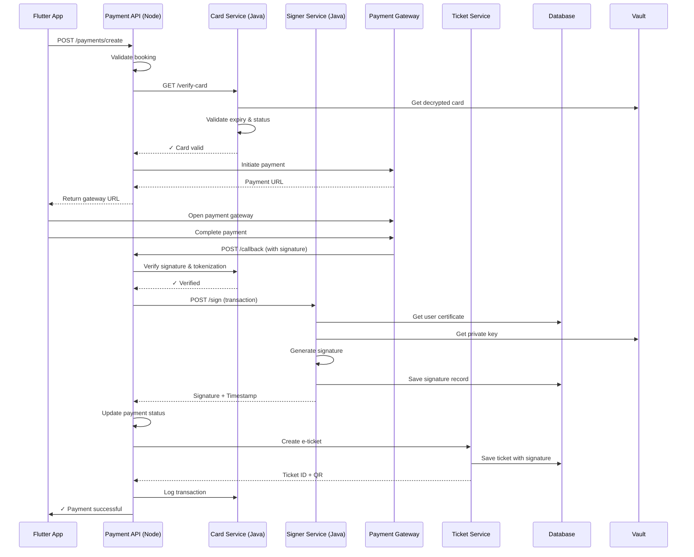

# Card & Signer Service - Payment Integration Guide

**Version:** 1.0  
**Status:** Integration Design  

---

## 1. Integration Architecture

```
Current System:
┌─────────────┐      ┌──────────────┐      ┌─────────────┐
│   Flutter   │─────▶│ Payment API  │─────▶│   Gateway   │
│    App      │      │  (Node.js)   │      │ (VNPay/MoMo)│
└─────────────┘      └──────────────┘      └─────────────┘

New System:
┌─────────────┐      ┌──────────────┐      ┌─────────────┐      ┌──────────┐
│   Flutter   │─────▶│ Payment API  │─────▶│  Card Srvc  │─────▶│  Vault   │
│    App      │      │  (Node.js)   │      │  (Java/JWT) │      │(Enc Keys)│
└─────────────┘      └──────────────┘      └─────────────┘      └──────────┘
                            │
                            ▼
                      ┌──────────────┐      ┌──────────────┐
                      │ Signer Srvc  │─────▶│   Ticket     │
                      │  (Java/Sig)  │      │   Service    │
                      └──────────────┘      └──────────────┘
```

---

## 2. Payment Flow Sequence

### 2.1 Complete Payment with Card & Signature



---

## 3. API Integration Points

### 3.1 Payment Service Updates

**File:** `payment-service/src/services/PaymentService.ts`

```typescript
// Updated payment creation with card verification
async createPayment(req: PaymentRequest): Promise<PaymentResponse> {
    // 1. Verify booking exists
    const booking = await Booking.findById(req.bookingId);
    if (!booking) throw new BookingNotFound();
    
    // 2. Call Card Service to verify card
    const cardVerification = await axios.post(
        `${CARD_SERVICE_URL}/api/v1/cards/${req.cardId}/verify`,
        { amount: booking.totalPrice },
        { headers: { Authorization: `Bearer ${getServiceToken()}` } }
    );
    
    if (!cardVerification.data.success) {
        throw new CardVerificationFailed();
    }
    
    // 3. Create payment in gateway
    const paymentGW = await this.gateway.initiate({
        amount: booking.totalPrice,
        description: `Booking ${booking.code}`,
        returnUrl: `${APP_URL}/payment/callback`,
        notifyUrl: `${API_URL}/payments/callback`
    });
    
    // 4. Save payment in DB
    const payment = new Payment({
        bookingId: booking._id,
        cardId: req.cardId,
        amount: booking.totalPrice,
        status: 'PENDING',
        gatewayTransactionId: paymentGW.transactionId,
        gatewayResponse: paymentGW.data
    });
    
    await payment.save();
    
    // 5. Log in audit
    await AuditLog.create({
        entityType: 'PAYMENT',
        entityId: payment._id,
        action: 'CREATED',
        changes: { payment: payment.toObject() }
    });
    
    return {
        paymentId: payment._id,
        gatewayUrl: paymentGW.paymentUrl
    };
}

// Updated payment callback
async handlePaymentCallback(req: CallbackRequest): Promise<void> {
    // 1. Verify gateway signature
    const isValid = this.gateway.verifySignature(req);
    if (!isValid) throw new InvalidSignature();
    
    // 2. Get payment record
    const payment = await Payment.findById(req.paymentId);
    if (!payment) throw new PaymentNotFound();
    
    // 3. Update payment status
    payment.status = req.status === 'success' ? 'SUCCESS' : 'FAILED';
    payment.processedAt = new Date();
    await payment.save();
    
    if (payment.status === 'SUCCESS') {
        // 4. Call Signer Service to sign transaction
        const signature = await axios.post(
            `${SIGNER_SERVICE_URL}/api/v1/sign`,
            {
                entityType: 'TRANSACTION',
                entityId: payment._id,
                data: Buffer.from(JSON.stringify({
                    bookingId: payment.bookingId,
                    amount: payment.amount,
                    timestamp: new Date().toISOString(),
                    cardToken: payment.cardId
                })).toString('base64')
            },
            { headers: { Authorization: `Bearer ${getServiceToken()}` } }
        );
        
        payment.digitalSignature = signature.data.signature_id;
        await payment.save();
        
        // 5. Create e-ticket
        const ticket = await axios.post(
            `${TICKET_SERVICE_URL}/api/v1/tickets`,
            {
                bookingId: payment.bookingId,
                signatureId: signature.data.signature_id,
                qrData: Buffer.from(payment._id.toString()).toString('base64')
            },
            { headers: { Authorization: `Bearer ${getServiceToken()}` } }
        );
        
        // 6. Send notification
        await NotificationService.sendPaymentSuccess(
            payment.bookingId,
            ticket.data.ticketId
        );
        
        // 7. Log success
        await AuditLog.create({
            entityType: 'PAYMENT',
            entityId: payment._id,
            action: 'SUCCESS',
            changes: {
                signature: signature.data.signature_id,
                ticket: ticket.data.ticketId
            }
        });
    } else {
        // Log failure
        await AuditLog.create({
            entityType: 'PAYMENT',
            entityId: payment._id,
            action: 'FAILED',
            error: req.errorMessage
        });
    }
}
```

---

## 4. Card Service - Payment Handler

**File:** `card-service/src/main/java/com/busz/card/service/PaymentIntegrationService.java`

```java
@Service
@RequiredArgsConstructor
@Slf4j
public class PaymentIntegrationService {
    
    private final CardService cardService;
    private final CardRepository cardRepository;
    private final CardTransactionRepository transactionRepository;
    private final AuditService auditService;
    
    /**
     * Verify card for payment and create transaction
     */
    @Transactional
    public CardVerificationDTO verifyCardForPayment(
        UUID cardId,
        UUID userId,
        BigDecimal amount
    ) throws Exception {
        
        // 1. Validate card exists and belongs to user
        Card card = cardRepository.findByUserIdAndIdAndDeletedAtIsNull(userId, cardId)
            .orElseThrow(() -> new CardNotFoundException());
        
        // 2. Check card is active
        if (!card.getIsActive() || card.getCardStatus() == CardStatus.BLOCKED) {
            throw new InactiveCardException();
        }
        
        // 3. Validate expiry
        LocalDate today = LocalDate.now();
        if (card.getExpiryYear() < today.getYear() ||
            (card.getExpiryYear() == today.getYear() && 
             card.getExpiryMonth() < today.getMonthValue())) {
            card.setCardStatus(CardStatus.EXPIRED);
            cardRepository.save(card);
            throw new CardExpiredException();
        }
        
        // 4. Check fraud detection
        if (isFraudulent(card, amount)) {
            card.setCardStatus(CardStatus.BLOCKED);
            cardRepository.save(card);
            throw new FraudDetectedException();
        }
        
        // 5. Log audit
        auditService.log(
            "CARD_VERIFICATION",
            "CARD",
            card.getId(),
            userId,
            "Card verified for payment: " + amount
        );
        
        return CardVerificationDTO.builder()
            .cardId(card.getId())
            .lastFour(card.getLastFour())
            .cardType(card.getCardType())
            .isValid(true)
            .verifiedAt(LocalDateTime.now())
            .build();
    }
    
    /**
     * Create card transaction record
     */
    @Transactional
    public CardTransactionDTO createTransaction(
        UUID cardId,
        UUID bookingId,
        BigDecimal amount,
        String currency,
        String transactionReference
    ) {
        Card card = cardRepository.findById(cardId)
            .orElseThrow(() -> new CardNotFoundException());
        
        CardTransaction transaction = CardTransaction.builder()
            .cardId(card.getId())
            .bookingId(bookingId)
            .amount(amount)
            .currency(currency)
            .status("PENDING")
            .transactionReference(transactionReference)
            .build();
        
        transactionRepository.save(transaction);
        
        log.info("Transaction created: {}", transaction.getId());
        
        return CardTransactionMapper.toDTO(transaction);
    }
    
    /**
     * Update transaction status after payment gateway response
     */
    @Transactional
    public void updateTransactionStatus(
        String transactionReference,
        String status,
        Map<String, Object> gatewayResponse
    ) {
        CardTransaction transaction = transactionRepository
            .findByTransactionReference(transactionReference)
            .orElseThrow(() -> new TransactionNotFoundException());
        
        transaction.setStatus(status);
        transaction.setGatewayResponse(gatewayResponse);
        transaction.setProcessedAt(LocalDateTime.now());
        
        transactionRepository.save(transaction);
        
        log.info("Transaction {} updated to {}", 
            transaction.getId(), status);
    }
    
    /**
     * Fraud detection logic
     */
    private boolean isFraudulent(Card card, BigDecimal amount) {
        // 1. Check transaction amount limit
        BigDecimal dailyLimit = BigDecimal.valueOf(50000000); // 50M VND
        List<CardTransaction> dailyTransactions = 
            transactionRepository.findByCardIdAndCreatedAtAfter(
                card.getId(),
                LocalDateTime.now().minusDays(1)
            );
        
        BigDecimal dailySum = dailyTransactions.stream()
            .map(CardTransaction::getAmount)
            .reduce(BigDecimal.ZERO, BigDecimal::add);
        
        if (dailySum.add(amount).compareTo(dailyLimit) > 0) {
            return true;
        }
        
        // 2. Check transaction frequency
        long transactionsLast30Min = transactionRepository
            .countByCardIdAndCreatedAtAfter(
                card.getId(),
                LocalDateTime.now().minusMinutes(30)
            );
        
        if (transactionsLast30Min > 5) {
            return true;
        }
        
        return false;
    }
}
```

---

## 5. Signer Service - Payment Signing

**File:** `signer-service/src/main/java/com/busz/signer/service/PaymentSigningService.java`

```java
@Service
@RequiredArgsConstructor
@Slf4j
public class PaymentSigningService {
    
    private final SignerService signerService;
    private final AuditService auditService;
    
    /**
     * Sign payment transaction
     */
    @Transactional
    public DigitalSignatureDTO signPaymentTransaction(
        String userId,
        PaymentSignRequest request
    ) throws Exception {
        
        // 1. Serialize payment data for signing
        String paymentData = serializePayment(request);
        
        // 2. Generate signature
        DigitalSignatureDTO signature = signerService.signData(
            SignRequest.builder()
                .entityType("TRANSACTION")
                .entityId(request.getPaymentId())
                .data(paymentData)
                .build(),
            userId
        );
        
        // 3. Log audit
        auditService.logSignature(
            signature.getSignatureId(),
            "TRANSACTION",
            request.getPaymentId(),
            "Payment signed",
            true
        );
        
        log.info("Payment transaction signed: {}", signature.getSignatureId());
        
        return signature;
    }
    
    /**
     * Verify payment signature (called when displaying ticket)
     */
    public VerificationResultDTO verifyPaymentSignature(
        UUID signatureId,
        String paymentData
    ) throws Exception {
        
        boolean isValid = signerService.verifySignature(
            signatureId,
            paymentData.getBytes()
        );
        
        auditService.logVerification(
            signatureId,
            isValid ? "VERIFIED" : "INVALID"
        );
        
        return VerificationResultDTO.builder()
            .signatureId(signatureId)
            .isValid(isValid)
            .verifiedAt(LocalDateTime.now())
            .build();
    }
    
    /**
     * Serialize payment data for consistent signing
     */
    private String serializePayment(PaymentSignRequest request) {
        ObjectMapper mapper = new ObjectMapper();
        Map<String, Object> payment = new LinkedHashMap<>();
        payment.put("bookingId", request.getBookingId());
        payment.put("paymentId", request.getPaymentId());
        payment.put("amount", request.getAmount());
        payment.put("currency", request.getCurrency());
        payment.put("timestamp", LocalDateTime.now().toString());
        payment.put("cardLast4", request.getCardLast4());
        
        try {
            return Base64.getEncoder().encodeToString(
                mapper.writeValueAsBytes(payment)
            );
        } catch (JsonProcessingException e) {
            throw new PaymentSerializationException(e);
        }
    }
}
```

---

## 6. Ticket Service - Signature Integration

**File:** `ticket-service/src/services/TicketService.ts` (Updated)

```typescript
// Create e-ticket with digital signature
async createTicketWithSignature(
    bookingId: string,
    signatureId: string,
    paymentId: string
): Promise<TicketResponse> {
    
    // 1. Get booking details
    const booking = await Booking.findById(bookingId);
    if (!booking) throw new BookingNotFound();
    
    // 2. Get signature details from Signer Service
    const signatureData = await axios.get(
        `${SIGNER_SERVICE_URL}/api/v1/signatures/${signatureId}`,
        { headers: { Authorization: `Bearer ${getServiceToken()}` } }
    );
    
    // 3. Generate ticket data
    const ticketData = {
        code: generateTicketCode(),
        bookingId: booking._id,
        paymentId: paymentId,
        signatureId: signatureId,
        timestamp: new Date().toISOString(),
        status: 'ACTIVE'
    };
    
    // 4. Generate QR code with ticket data
    const qrCode = await QRCode.toDataURL(
        JSON.stringify(ticketData)
    );
    
    // 5. Create ticket record
    const ticket = new Ticket({
        ...ticketData,
        qrCode: qrCode,
        signatureVerified: true,
        signatureTimestamp: signatureData.data.timestamp
    });
    
    await ticket.save();
    
    // 6. Send to customer
    await sendTicketToCustomer(booking.userId, ticket);
    
    return {
        ticketId: ticket._id,
        code: ticket.code,
        qrCode: ticket.qrCode,
        signatureId: signatureId,
        status: 'ACTIVE'
    };
}
```

---

## 7. End-to-End Testing

### 7.1 Integration Test

```java
@SpringBootTest
@ActiveProfiles("test")
class PaymentIntegrationTest {
    
    @Autowired
    private MockMvc mockMvc;
    
    @MockBean
    private PaymentGatewayClient gatewayClient;
    
    @MockBean
    private CardServiceClient cardServiceClient;
    
    @MockBean
    private SignerServiceClient signerServiceClient;
    
    @Test
    @DisplayName("Complete payment flow with card & signature")
    void testCompletePaymentFlow() throws Exception {
        // 1. Verify card
        CardVerificationDTO cardVerification = 
            new CardVerificationDTO("VISA", "0366", true);
        when(cardServiceClient.verifyCard(any(), any()))
            .thenReturn(cardVerification);
        
        // 2. Create payment
        String paymentId = UUID.randomUUID().toString();
        CreatePaymentRequest request = CreatePaymentRequest.builder()
            .bookingId("booking-123")
            .cardId("card-456")
            .amount(250000)
            .build();
        
        mockMvc.perform(post("/api/v1/payments")
            .contentType(MediaType.APPLICATION_JSON)
            .content(objectMapper.writeValueAsString(request)))
            .andExpect(status().isCreated())
            .andExpect(jsonPath("$.data.payment_id").exists());
        
        // 3. Mock gateway callback
        PaymentCallbackRequest callback = PaymentCallbackRequest.builder()
            .paymentId(paymentId)
            .status("success")
            .transactionId("txn-789")
            .build();
        
        // 4. Verify signature was created
        DigitalSignatureDTO signature = new DigitalSignatureDTO(
            "sig-001", "TRANSACTION", "txn-789", true
        );
        when(signerServiceClient.signPayment(any()))
            .thenReturn(signature);
        
        // 5. Verify ticket was created
        mockMvc.perform(post("/api/v1/payments/callback")
            .contentType(MediaType.APPLICATION_JSON)
            .content(objectMapper.writeValueAsString(callback)))
            .andExpect(status().isOk());
        
        verify(signerServiceClient).signPayment(any());
    }
}
```

---

## 8. Error Handling

```java
// Payment Integration Error Handler
@ExceptionHandler(CardVerificationFailed.class)
public ResponseEntity<?> handleCardVerificationFailed(
    CardVerificationFailed e
) {
    return ResponseEntity.status(402) // Payment Required
        .body(ApiResponse.error(
            "CARD_VERIFICATION_FAILED",
            "Card verification failed. Please try another card."
        ));
}

@ExceptionHandler(FraudDetectedException.class)
public ResponseEntity<?> handleFraudDetected(
    FraudDetectedException e
) {
    return ResponseEntity.status(403)
        .body(ApiResponse.error(
            "PAYMENT_BLOCKED",
            "Payment blocked due to fraud detection. Contact support."
        ));
}

@ExceptionHandler(SignatureException.class)
public ResponseEntity<?> handleSignatureException(
    SignatureException e
) {
    log.error("Signature generation failed", e);
    return ResponseEntity.status(500)
        .body(ApiResponse.error(
            "SIGNATURE_ERROR",
            "Failed to sign transaction. Please try again."
        ));
}
```

---

## 9. Rollback Strategy

```yaml
Deployment Strategy:
  Phase 1 (Shadow):
    - New Card Service runs alongside existing payment
    - No actual usage, only monitoring
    - Duration: 1 week
  
  Phase 2 (Canary):
    - 10% of payments routed to new system
    - Monitor error rates
    - Duration: 1 week
  
  Phase 3 (Gradual):
    - Increase to 50%, then 100%
    - Monitor at each step
    - Rollback available anytime
  
  Phase 4 (Cutover):
    - 100% traffic to new system
    - Legacy system in standby
    - Keep for 30 days before decommission
```

---

**Version:** 1.0  
**Last Updated:** 2026-08-13
