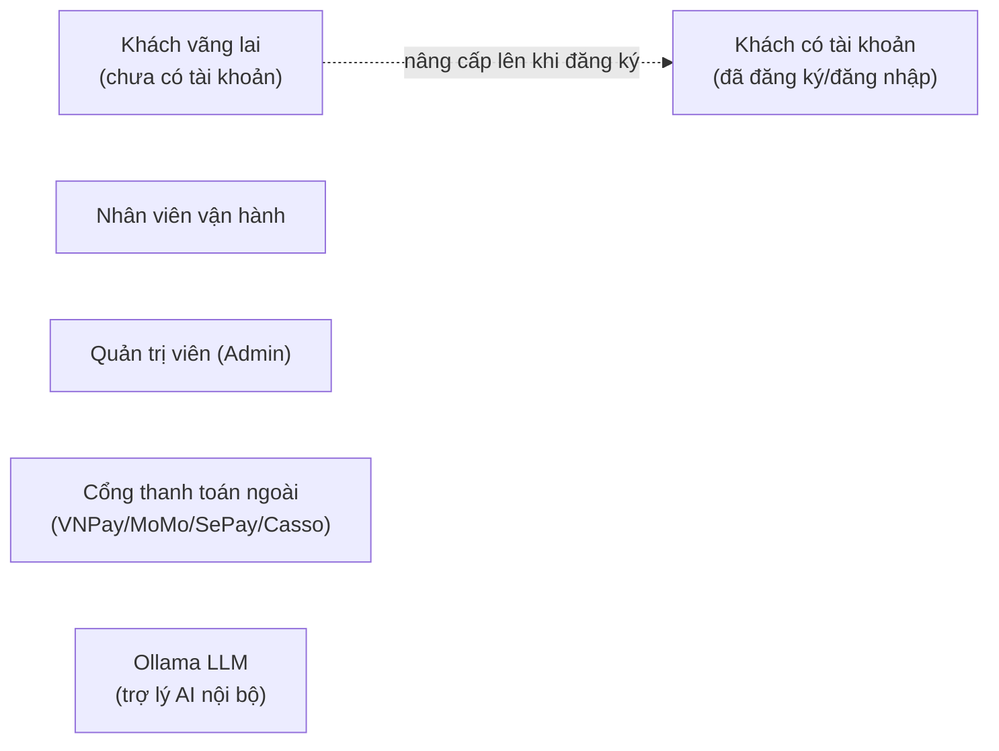
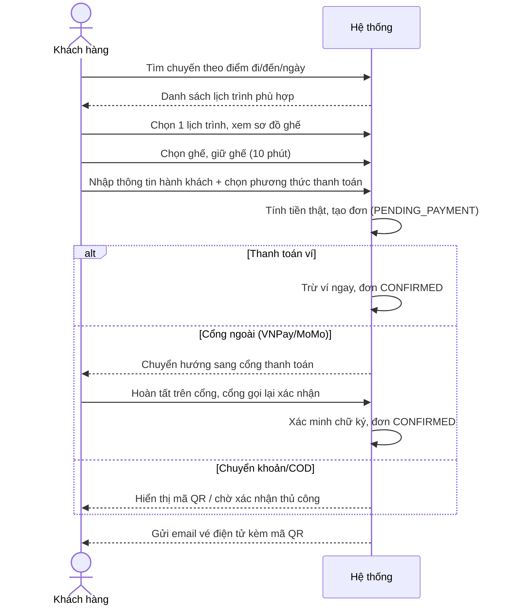
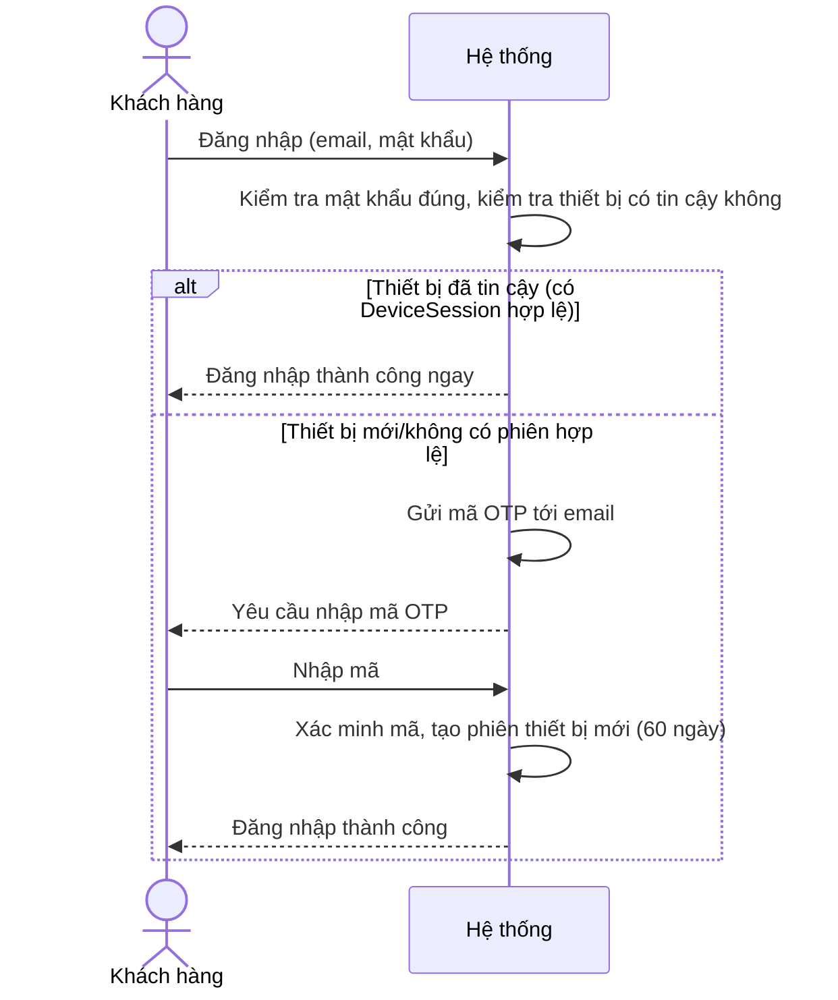
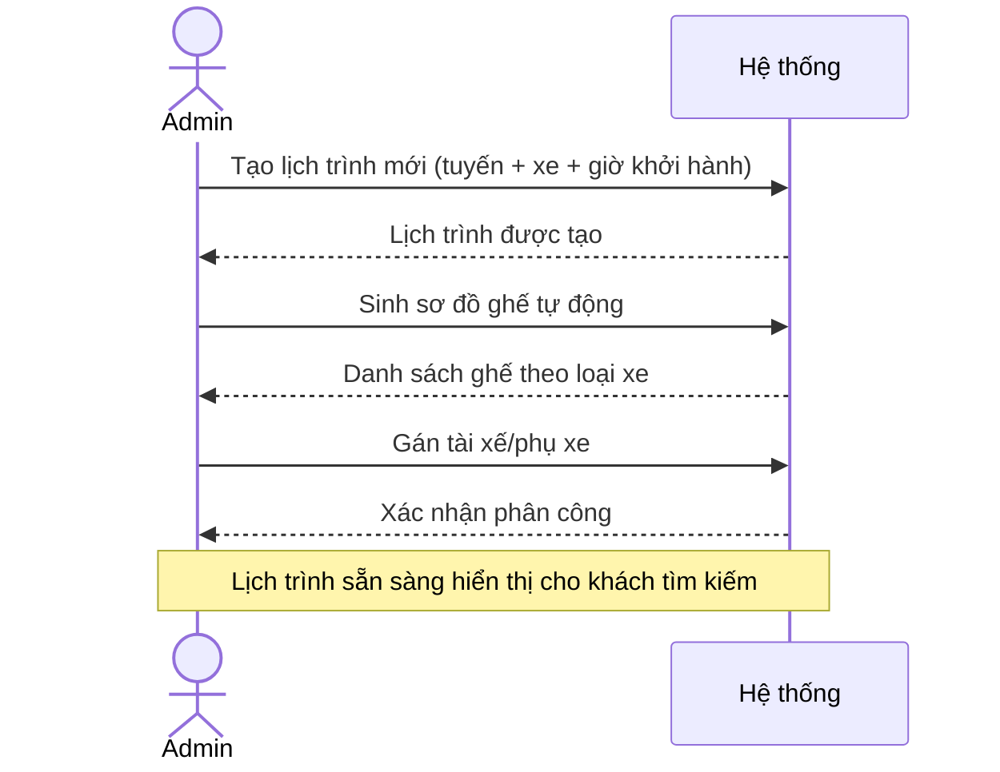
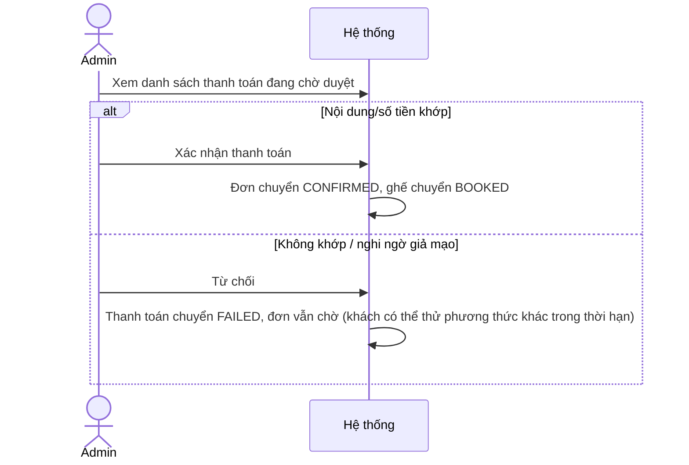

# Phân tích & Đặc tả hệ thống — An Chuyến

> Tài liệu đặc tả (SRS) được xây dựng từ hệ thống **đã cài đặt thật** (không phải đặc tả lý thuyết trước khi code) — đối chiếu với `docs/TONG-QUAN-DU-AN.md` và `docs/architecture/00-14`. Mọi yêu cầu chức năng liệt kê dưới đây đều có endpoint/route/service tương ứng đã chạy được; phần "chưa hoàn thiện" được đánh dấu riêng.

## 1. Giới thiệu

### 1.1 Bối cảnh

An Chuyến là hệ thống đặt vé xe khách trực tuyến, mô hình 2 phía: khách hàng tự đặt vé qua web, nhà xe/nhân viên vận hành qua dashboard admin. Hệ thống giải quyết 3 bài toán cốt lõi của loại hình này: **tìm chuyến & chọn ghế theo thời gian thực**, **chống trùng ghế khi nhiều người cùng đặt**, và **xác nhận thanh toán tự động qua nhiều cổng**.

### 1.2 Mục tiêu hệ thống

- Cho phép khách tìm kiếm, đặt vé xe khách end-to-end mà không cần liên hệ tổng đài.
- Cho phép khách **vãng lai** (không cần lập tài khoản đầy đủ) vẫn đặt được vé, đồng thời **xác thực danh tính bằng email/OTP** để chống giả mạo và cho phép tra cứu lại đơn.
- Cho nhà xe một công cụ vận hành tập trung: quản lý tuyến/chuyến/xe/nhân sự, duyệt thanh toán thủ công, xem báo cáo doanh thu, hỗ trợ khách qua chat.
- Đảm bảo tính toàn vẹn dữ liệu ghế/tiền trong môi trường nhiều người dùng đồng thời.

### 1.3 Phạm vi

**Trong phạm vi:** tìm chuyến, chọn & giữ ghế, đặt vé, 5 phương thức thanh toán (Ví nội bộ, VNPay, MoMo, Chuyển khoản VietQR, COD/tiền mặt), huỷ vé & hoàn tiền theo chính sách, xác thực OTP qua email, quản lý vận hành toàn diện phía admin, chatbot AI hỗ trợ, dịch vụ phụ (thuê xe, giao hàng, tour, khách sạn), chương trình khách hàng thân thiết (loyalty/wallet).

**Ngoài phạm vi hiện tại** (đã thiết kế hạ tầng nhưng chưa hoàn thiện đầu-cuối): theo dõi vị trí xe trên bản đồ theo thời gian thực cho khách (Socket.IO đã có ở backend, chưa có UI tiêu thụ), chat hỗ trợ đẩy tin theo thời gian thực (hiện là REST polling thủ công), hoàn tiền tự động qua API VNPay/MoMo khi huỷ vé.

### 1.4 Từ điển thuật ngữ

| Thuật ngữ | Ý nghĩa |
|---|---|
| Chuyến (Trip) | Một tuyến cố định giữa 2 điểm, chạy lặp lại theo lịch |
| Lịch trình (TripSchedule) | Một lần chạy cụ thể của Chuyến, gắn 1 xe (Bus), 1 giờ khởi hành |
| Giữ ghế (Hold) | Khoá tạm 1 ghế trong 10 phút để khách hoàn tất thông tin trước khi đặt chính thức |
| Booking | Đơn đặt vé — 1 booking có thể gồm nhiều ghế/hành khách trên cùng 1 lịch trình |
| Danh tính khách vãng lai (Guest Identity) | Phiên xác thực nhẹ dựa trên cookie thiết bị, không cần mật khẩu, cấp khi khách nhập email lúc đặt vé lần đầu |
| Thiết bị tin cậy | Thiết bị đã từng đăng nhập thành công và còn `DeviceSession` hợp lệ (60 ngày) — không bị yêu cầu OTP ở lần đăng nhập kế tiếp |

## 2. Đối tượng sử dụng hệ thống (Actors)

| Actor | Mô tả | Quyền hạn chính |
|---|---|---|
| Khách vãng lai | Đặt vé chỉ bằng email, không cần mật khẩu | Tìm chuyến, giữ ghế, đặt vé, tra cứu đơn bằng email+mã đơn |
| Khách có tài khoản | Đã đăng ký (qua OTP email) hoặc Google OAuth | Toàn bộ quyền khách vãng lai + xem lịch sử vé, huỷ vé, hồ sơ cá nhân, ví, điểm thưởng |
| Nhân viên vận hành | Tài khoản `role=admin` dùng cho tác vụ hàng ngày | CRUD dữ liệu vận hành, tạo lịch trình, sinh sơ đồ ghế, duyệt thanh toán thủ công |
| Quản trị viên | Cùng bảng `User`, `role=admin` (không phân cấp admin/staff riêng trong hệ thống hiện tại) | Toàn quyền như nhân viên vận hành + mời người dùng mới, nạp ví hộ khách, xem báo cáo tổng |
| Cổng thanh toán ngoài | Hệ thống bên thứ 3 | Gọi webhook/IPN xác nhận thanh toán, không có giao diện |

## 3. Yêu cầu chức năng (Functional Requirements)

Đánh mã `FR-<nhóm>-<số>`, mỗi mã map trực tiếp tới 1 route/service thật.

### 3.1 Nhóm Xác thực & Danh tính (Identity)

| Mã | Yêu cầu | Cấu phần hiện thực |
|---|---|---|
| FR-ID-01 | Hệ thống phải cho phép đăng ký tài khoản bằng email, và **chỉ tạo tài khoản sau khi email đã được xác minh bằng mã OTP 6 số** | `POST /api/identity/otp/request-registration` → `POST /api/auth/register` |
| FR-ID-02 | Hệ thống phải cho phép đăng nhập bằng email/mật khẩu | `POST /api/auth/login` |
| FR-ID-03 | Khi đăng nhập từ thiết bị chưa từng đăng nhập thành công, hệ thống phải yêu cầu xác minh OTP trước khi cấp phiên đăng nhập | `POST /api/auth/login` (trả `requiresOtp`) → `POST /api/auth/login/verify-otp` |
| FR-ID-04 | Hệ thống phải cho phép đăng nhập bằng tài khoản Google | `POST /api/auth/google` |
| FR-ID-05 | Hệ thống phải cho phép khách vãng lai đặt vé chỉ bằng cách cung cấp email, không cần mật khẩu, và tự động cấp phiên thiết bị để dùng lại cho các thao tác kế tiếp trong 60 ngày | `guestBookingIdentity` middleware, `IdentityService.identifyGuestByEmail` |
| FR-ID-06 | Hệ thống phải cho phép khách tra cứu lại đơn hàng bằng email + mã đơn mà không cần đăng nhập | `POST /api/identity/lookup-order` |
| FR-ID-07 | Hệ thống phải giới hạn số lần xin mã và số lần nhập sai OTP để chống brute-force | cooldown 60s, `OTP_MAX_ATTEMPTS=5`, `otpLimiter` 20 req/15 phút |
| FR-ID-08 | Hệ thống phải cho phép đặt lại mật khẩu qua liên kết gửi tới email | `POST /api/auth/forgot-password`, `/reset-password` *(⚠ hiện chưa gửi email thật, xem mục 7)* |

### 3.2 Nhóm Tìm kiếm & Chọn ghế

| Mã | Yêu cầu | Cấu phần hiện thực |
|---|---|---|
| FR-SR-01 | Hệ thống phải cho phép tìm chuyến theo điểm đi, điểm đến, ngày khởi hành | `GET /api/trips` |
| FR-SR-02 | Hệ thống phải hiển thị sơ đồ ghế thực tế của từng lịch trình, phân biệt ghế trống/đã đặt/đang bị giữ | `GET /trip-schedules/:id/seats` |
| FR-SR-03 | Hệ thống phải cho phép giữ tạm tối đa các ghế đã chọn trong 10 phút để khách hoàn tất thông tin, và từ chối nếu ghế vừa bị người khác giữ/đặt | `POST /trip-schedules/:id/seats/hold` (chống race condition bằng `updateMany` có điều kiện) |
| FR-SR-04 | Hệ thống phải tự động nhả ghế đã giữ nếu khách không hoàn tất đặt vé trong thời gian giữ | dọn "lazy" mỗi khi có request seat map/hold mới |

### 3.3 Nhóm Đặt vé & Thanh toán

| Mã | Yêu cầu | Cấu phần hiện thực |
|---|---|---|
| FR-BK-01 | Hệ thống phải tạo đơn đặt vé gồm nhiều hành khách/ghế trên cùng 1 lịch trình trong 1 giao dịch nguyên tử | `POST /api/bookings/create` — transaction 8 bước |
| FR-BK-02 | Hệ thống phải tự tính tổng tiền dựa trên bảng giá thực tế (không tin số tiền client gửi lên), có áp dụng mã giảm giá nếu hợp lệ | `BookingService.createBooking` bước 4-5 |
| FR-BK-03 | Hệ thống phải hỗ trợ tối thiểu 5 phương thức thanh toán: Ví nội bộ, VNPay, MoMo, Chuyển khoản (VietQR), COD | `payment.routes.ts`, `vnpay/momo/bank-transfer/mock-gateway.routes.ts` |
| FR-BK-04 | Với thanh toán qua cổng ngoài (VNPay/MoMo), hệ thống phải tự động xác nhận đơn khi nhận được callback hợp lệ (chữ ký đúng), không cần thao tác thủ công | `GET .../return`, `GET/POST .../ipn` → `confirm.util.ts::confirmPaymentSuccess` |
| FR-BK-05 | Với chuyển khoản ngân hàng, hệ thống phải tự đối soát qua webhook (SePay/Casso) bằng cách khớp nội dung chuyển khoản và số tiền chính xác | `bank-transfer.routes.ts` |
| FR-BK-06 | Việc xác nhận thanh toán phải là thao tác bất biến (idempotent) — gọi lại nhiều lần (webhook trùng lặp) không được xử lý 2 lần | kiểm tra `Payment.status === PAID` trước khi xử lý |
| FR-BK-07 | Hệ thống phải cho phép khách xem danh sách vé đã đặt và huỷ vé (nếu còn ở trạng thái cho phép huỷ) | `GET /api/bookings`, `POST /api/bookings/:id/cancel` |
| FR-BK-08 | Khi huỷ vé đã thanh toán bằng ví nội bộ, hệ thống phải tự động hoàn tiền theo % quy định trong chính sách huỷ của nhà xe (theo số giờ còn lại tới giờ khởi hành) | `BookingService.cancelBooking` + `CancellationPolicy` |
| FR-BK-09 | Hệ thống phải tự động huỷ đơn và nhả ghế nếu khách không thanh toán trong thời gian quy định (mặc định 30 phút) | cron `releaseExpiredBookings` chạy mỗi 5 phút |
| FR-BK-10 | Hệ thống phải gửi email xác nhận đơn hàng ngay khi tạo đơn, và gửi vé điện tử (kèm mã QR) khi thanh toán thành công | `booking.email.ts` |

### 3.4 Nhóm Tài khoản & Ví

| Mã | Yêu cầu | Cấu phần hiện thực |
|---|---|---|
| FR-AC-01 | Khách phải xem và cập nhật được hồ sơ cá nhân | `GET/PUT /api/auth/profile` |
| FR-AC-02 | Khách phải xem được số dư và lịch sử giao dịch ví nội bộ | `GET /api/wallet/me` |
| FR-AC-03 | Khách phải xem được điểm thưởng tích luỹ (loyalty) | `GET /api/loyalty/me` |
| FR-AC-04 | Khách phải nhận và sử dụng được mã giảm giá (voucher) hợp lệ, không dùng trùng lặp | ràng buộc `@@unique([userId, promotionId])` trên `Voucher` |

### 3.5 Nhóm Vận hành (Admin)

| Mã | Yêu cầu | Cấu phần hiện thực |
|---|---|---|
| FR-AD-01 | Admin phải quản lý (CRUD) toàn bộ dữ liệu vận hành: tuyến, chuyến, lịch trình, xe, nhân sự, ghế, đặt vé, thanh toán, khuyến mãi, nội dung trang khách... | `createCrudRouter` — 24 resource |
| FR-AD-02 | Admin phải tạo lịch trình chạy mới và sinh sơ đồ ghế tự động cho lịch trình đó | `POST /admin/tripSchedules/:id/generate-seats` |
| FR-AD-03 | Admin phải phân công tài xế/phụ xe cho từng lịch trình | `PUT /admin/tripSchedules/:id/assign` |
| FR-AD-04 | Admin phải duyệt hoặc từ chối thủ công các thanh toán không tự xác nhận được (COD, chuyển khoản sai nội dung) | `POST /payments/cod/confirm`, `POST /payments/admin/reject` |
| FR-AD-05 | Admin phải xem báo cáo tổng quan (số liệu đặt vé/doanh thu) và phân tích theo thời gian | `GET /admin/stats`, `GET /admin/analytics/overview` |
| FR-AD-06 | Admin phải mời (invite) người dùng mới vào hệ thống qua Supabase Auth | `POST /admin/invite-user` |
| FR-AD-07 | Admin phải nạp tiền vào ví hộ một khách hàng cụ thể | `POST /admin/users/:id/wallet/topup` |
| FR-AD-08 | Admin phải trả lời tin nhắn hỗ trợ của khách hàng qua giao diện chat tập trung | `/admin/support/conversations*` |

### 3.6 Nhóm Dịch vụ phụ & Tiện ích

| Mã | Yêu cầu | Cấu phần hiện thực |
|---|---|---|
| FR-EX-01 | Hệ thống phải cho phép đặt tour du lịch, đặt phòng khách sạn, thuê xe, gửi hàng (đơn giản, không có quy trình phức tạp như vé xe) | `tour/destination/hotel/rental/delivery.routes.ts` |
| FR-EX-02 | Hệ thống phải cung cấp trợ lý AI trả lời câu hỏi của khách dựa trên dữ liệu thật của hệ thống (RAG đơn giản) | `POST /api/ai/chat` → Ollama |
| FR-EX-03 | Hệ thống phải hiển thị banner, sự kiện, điểm đến nổi bật trên trang chủ, quản lý được từ admin và có cache để giảm tải DB | `banner/hero/event/destination.routes.ts` + `core/cache.ts` |

## 4. Yêu cầu phi chức năng (Non-Functional Requirements)

| Mã | Yêu cầu | Hiện trạng cài đặt |
|---|---|---|
| NFR-01 | Chống trùng ghế khi nhiều khách cùng thao tác đồng thời | `updateMany` điều kiện trong `$transaction`, dựa vào row-lock ngầm của PostgreSQL — đã kiểm chứng, không cần Redis/lock phân tán |
| NFR-02 | Chống tấn công brute-force vào các endpoint nhạy cảm | `authLimiter` (20/15p cho `/api/auth`), `otpLimiter` (20/15p cho `/api/identity`), `apiLimiter` chung (300/15p toàn `/api`) |
| NFR-03 | Không được tin dữ liệu giá tiền do client gửi lên | Toàn bộ `totalAmount` tính lại phía server trong `BookingService.createBooking` |
| NFR-04 | Chống dò email đã tồn tại trong hệ thống qua chức năng OTP | Response OTP luôn giống nhau (`GENERIC_OTP_RESPONSE`) bất kể email tồn tại hay không; gửi mail không đồng bộ để không lộ qua thời gian phản hồi |
| NFR-05 | Dữ liệu nhạy cảm (mật khẩu, số CCCD) không được lộ ra response API | `createCrudRouter` tự strip `password`; `mask.ts::maskIdCard` che một phần số CCCD ở các API trả cho admin |
| NFR-06 | Hiệu năng tải trang — giảm kích thước bundle ban đầu | Toàn bộ route ở `web/` và `admin/` dùng `React.lazy()` |
| NFR-07 | Giảm tải truy vấn lặp lại cho dữ liệu ít thay đổi (banner, tuyến, cấu hình) | Cache in-memory (`NodeCache`) 300 giây, tự invalidate khi admin sửa qua CRUD |
| NFR-08 | Cách ly phiên đăng nhập giữa web khách hàng và admin | 2 cơ chế lưu token độc lập: `sessionStorage['busz_token']` (web) vs `localStorage['admin_token']` (admin) |
| NFR-09 | Toàn vẹn giao dịch tài chính | Toàn bộ thao tác tạo booking + trừ ví + tạo payment nằm trong 1 Prisma `$transaction` (rollback toàn bộ nếu 1 bước lỗi) |
| NFR-10 | Khả năng vận hành khi thiếu cấu hình bên ngoài (thanh toán, email) không được crash toàn hệ thống | Các cổng thanh toán/email trả lỗi rõ ràng (500/log warning) khi thiếu biến môi trường, không silent-fail nhưng cũng không sập server |

## 5. Đặc tả use case chính

### 5.1 UC-01: Đặt vé xe (happy path)

**Điều kiện tiên quyết:** ghế còn trống tại thời điểm giữ.
**Điều kiện sau:** ghế chuyển `BOOKED`, `Booking.status = CONFIRMED`, khách nhận được vé điện tử.
**Luồng lỗi:** ghế bị người khác giữ trước → HTTP 409, khách chọn ghế khác; không đủ tiền trong ví → giao dịch rollback toàn bộ.

### 5.2 UC-02: Đăng nhập từ thiết bị mới (yêu cầu OTP)

### 5.3 UC-03: Vận hành lịch trình (Admin)

### 5.4 UC-04: Đối soát và duyệt thanh toán thủ công

## 6. Đặc tả dữ liệu (tóm tắt — ERD đầy đủ ở `architecture/05-database-map.md`)

Hệ thống dùng mô hình quan hệ, 49 thực thể (entity) chính, nhóm theo miền nghiệp vụ:

- **Người dùng & phiên**: `User`, `Profile`, `DeviceSession`, `EmailOtp`, `PasswordResetToken`
- **Chuyến đi**: `Route`, `Trip`, `TripSchedule`, `Checkpoint`, `TripPrice`, `Seat`, `SeatType`
- **Đặt vé**: `Booking`, `Passenger`, `SeatBooking`, `Ticket`, `BookingTimeline`, `Review`
- **Thanh toán & tài chính**: `Payment`, `Wallet`, `WalletTransaction`, `UserPaymentMethod`, `Promotion`, `Voucher`, `Loyalty`, `LoyaltyHistory`
- **Đội xe & nhân sự**: `BusAgent`, `Bus`, `BusImage`, `Facility`, `Employee`, `TripStaffAssignment`, `CancellationPolicy`
- **Nội dung & dịch vụ phụ**: `Banner`, `HeroSlide`, `Destination`, `Hotel`, `Event`, `Tour`, `TourBooking`, `RentalCar`, `RentalBooking`, `DeliveryOrder`, `DeliveryVehicle`, `Contact`
- **Hỗ trợ khách hàng**: `SupportConversation`, `SupportMessage`

Ràng buộc toàn vẹn quan trọng đã cài đặt: `Seat` là duy nhất theo `(tripScheduleId, seatNumber)`; `Payment` là 1-1 với `Booking`; `Voucher` là duy nhất theo `(userId, promotionId)` để chống dùng lại mã giảm giá.

## 7. Giới hạn đã biết của hệ thống hiện tại

Các mục này được liệt kê minh bạch để làm cơ sở cho kế hoạch cải tiến tiếp theo (không phải lỗi ẩn):

1. Phần lớn lỗi nghiệp vụ (hết ghế lúc tạo đơn, mã giảm giá sai, ví không đủ tiền) trả mã lỗi HTTP 500 thay vì 4xx phù hợp — ảnh hưởng khả năng phân biệt lỗi phía client tích hợp.
2. `POST /api/loyalty/add` chưa được bảo vệ bằng middleware xác thực.
3. Không có API hoàn tiền tự động qua VNPay/MoMo — huỷ vé đã thanh toán qua cổng ngoài cần xử lý hoàn tiền thủ công ngoài hệ thống.
4. Theo dõi vị trí xe thời gian thực (Socket.IO) đã có ở backend nhưng chưa có giao diện khách hàng sử dụng.
5. Chat hỗ trợ chưa đẩy tin nhắn theo thời gian thực — admin cần tải lại để thấy tin nhắn mới.
6. Quên mật khẩu (`forgot-password`) chưa gửi email thật dù hạ tầng gửi mail (Resend) đã sẵn sàng từ tính năng OTP.
7. Chưa có bộ test tự động cho luồng OTP/xác thực thiết bị mới.
8. Admin dashboard chưa áp dụng cơ chế OTP thiết bị mới như phía khách hàng.

## 8. Tài liệu liên quan

- Tổng quan kỹ thuật & vận hành: [`docs/TONG-QUAN-DU-AN.md`](TONG-QUAN-DU-AN.md)
- Chi tiết kiến trúc, API, ERD, từng luồng nghiệp vụ (có sequence diagram đầy đủ theo từng request thật): [`docs/architecture/00-14`](architecture/00-master-system-map.md)
