# 00 — Master System Map

> Toàn bộ nội dung trong `docs/architecture/` được rút trực tiếp từ source code hiện tại của repo `an_chuyen` (không suy đoán). Mỗi thành phần trong sơ đồ trỏ được về một file thật. Ký hiệu dùng xuyên suốt:
> - `[NOT IMPLEMENTED]` — có nhắc tới (biến, enum, route mock, tên) nhưng không có logic thật.
> - `[UNUSED]` — có code/dependency nhưng không có gì gọi tới nó.
> - `[MISSING]` — code tham chiếu tới resource/cấu hình không tồn tại hoặc không khớp với phần khác của hệ thống.

## Cách đọc bộ tài liệu này

1. Bắt đầu ở đây để có bức tranh tổng.
2. [01-project-resource-map.md](01-project-resource-map.md) — cây thư mục thật, vai trò từng phần.
3. [02-frontend-map.md](02-frontend-map.md) / [03-backend-map.md](03-backend-map.md) — kiến trúc theo layer.
4. [04-api-map.md](04-api-map.md) — toàn bộ endpoint thật, route → controller/service → Prisma model.
5. [05-database-map.md](05-database-map.md) — ERD từ `schema.prisma`.
6. [06](06-booking-flow.md)→[11](11-error-edge-cases.md) — các business flow cụ thể (đặt vé, khoá ghế, thanh toán, admin, realtime, lỗi).
7. [12-user-journey.md](12-user-journey.md) / [13-admin-journey.md](13-admin-journey.md) — trình tự đầy đủ (sequence diagram) của toàn bộ hành trình user và admin, bao gồm thứ tự request-response tới từng API thật.

## Sơ đồ tổng (Mermaid, tên thật từ code)

```mermaid
flowchart TD
    USER["Người dùng"]

    subgraph FE["FRONTEND"]
        WEB["web/ — React 18 + Vite + React Router\nsrc/App.tsx"]
        ADMIN["admin/ — React 18 + Vite + React Router\n('studio-admin', app/(main)/... chỉ là quy ước đặt tên thư mục,\nKHÔNG phải Next.js routing thật — xem 02-frontend-map.md)"]
    end

    subgraph BE["BACKEND — backend/src/index.ts (Express, cổng 3000)"]
        AUTHR["/api/auth\nauth.routes.ts"]
        BOOKR["/api/bookings\nbooking.routes.ts → BookingService"]
        SEATR["/api/trip-schedules\nseat.routes.ts → SeatService"]
        PAYR["/api/payments, /api/vnpay, /api/momo,\n/api/mock-payment, /api/bank-transfer"]
        ADMINR["/api/admin\nadmin.routes.ts (requireAdmin, 24 CRUD resource)"]
        AIR["/api/ai\nai.routes.ts → ai.service.ts"]
        CONTENTR["/api/tours,/hotels,/destinations,/rentals,\n/deliveries,/banners,/hero-slides,/events,/contacts"]
        PUBLICR["/api/trips,/promotions,/reviews,/stations,/configs\n(đăng ký thẳng trong index.ts)"]
    end

    subgraph DATA["DỮ LIỆU"]
        PG[("PostgreSQL (Supabase)\nvia Prisma — schema.prisma, 49 model")]
        CACHE["In-memory cache\ncore/cache.ts — NodeCache + AsyncLock\n(KHÔNG phải Redis — không có dependency redis)"]
    end

    subgraph RT["REALTIME — core/socket.ts (Socket.IO)"]
        SOCK["events thật: join_trip, leave_trip,\nupdate_location, location_updated\n(chỉ theo dõi GPS xe — KHÔNG có event cho ghế)"]
    end

    subgraph PAYEXT["PAYMENT — bên ngoài"]
        VNPAY["VNPay (vnpay.util.ts)"]
        MOMO["MoMo (momo.util.ts)"]
        VIETQR["VietQR img service (BankTransferQRPage.tsx, FE only)"]
        SEPAY["SePay webhook (bank-transfer.routes.ts)"]
        CASSO["Casso webhook (bank-transfer.routes.ts)"]
    end

    subgraph AUTHEXT["AUTH"]
        JWT["JWT (jsonwebtoken) — auth.middleware.ts"]
        SUPA["Supabase Auth — core/supabase.ts\n(dùng làm fallback verify + admin invite-user)"]
        GOOGLE["Google OAuth — auth.routes.ts POST /google\n(google-auth-library)"]
    end

    subgraph AIEXT["AI"]
        OLLAMA["Ollama local LLM (ai.service.ts)\ngọi thật: fetch OLLAMA_BASE_URL/api/chat"]
        GENAI["@google/genai dependency [UNUSED]\nkhông có import nào dùng nó trong backend/src"]
        GEMINI_ENV["GEMINI_MODEL / AI_PROVIDER=gemini\ntrong docker-compose.yml [MISSING]\n— code ai.service.ts không đọc 2 biến này, gọi thẳng Ollama"]
    end

    USER --> WEB
    USER --> ADMIN
    WEB --> AUTHR & BOOKR & SEATR & PAYR & AIR & CONTENTR & PUBLICR
    ADMIN --> AUTHR & ADMINR
    ADMIN -. "WebSocket client [NOT IMPLEMENTED]\nkhông tìm thấy socket.io-client trong admin/" .-> SOCK

    AUTHR --> JWT
    AUTHR --> GOOGLE
    ADMINR --> SUPA

    BOOKR --> PG
    SEATR --> PG
    PAYR --> PG
    ADMINR --> PG
    CONTENTR --> CACHE --> PG
    PUBLICR --> CACHE

    PAYR --> VNPAY & MOMO & SEPAY & CASSO
    AIR --> OLLAMA

    WEB -. "socket.io-client [NOT IMPLEMENTED]\nkhông có trong web/package.json hay bất kỳ import nào" .-> SOCK
```

## Đối chiếu nhanh: cái gì THẬT, cái gì KHÔNG

| Thành phần trong hạ tầng/docs | Trạng thái thật trong code |
|---|---|
| Redis cache (nhắc ở docker-compose cũ / README) | `[MISSING]` — thực tế là `NodeCache` in-memory (`core/cache.ts`), không có redis package |
| AI dùng Gemini (`AI_PROVIDER=gemini`, `GEMINI_MODEL` trong docker-compose) | `[MISSING]` — `ai.service.ts` gọi Ollama local, không đọc 2 biến môi trường này |
| `@google/genai` trong `backend/package.json` | `[UNUSED]` — không có import nào trong `backend/src` |
| Socket event cho khoá ghế (`seat:locked`, `seat:released`...) | `[NOT IMPLEMENTED]` — `core/socket.ts` chỉ có `update_location`/`location_updated`/`join_trip`/`leave_trip` |
| Client thật sự kết nối tới Socket.IO server | `[NOT IMPLEMENTED]` — không có `socket.io-client` trong `web/package.json` lẫn `admin/package.json`, không tìm thấy lời gọi `io(...)` nào ở FE. `core/socket.ts` hiện là hạ tầng backend chưa có consumer |
| `admin/next.config.mjs`, `admin/src/app/(main)/...` như Next.js App Router | `[UNUSED]` cơ chế Next thật — admin chạy bằng Vite (`"dev": "vite"`), thư mục `app/(main)/...` chỉ là quy ước đặt tên copy từ template, được import thủ công trong `admin/src/App.tsx` bằng React Router |
| `BookingStatus.DRAFT`, `REFUNDING` (trong `schema.prisma`) | `[NOT IMPLEMENTED]` — không có chỗ nào trong `backend/src` gán 2 giá trị này |
| `BookingStatus.COMPLETED` | `[NOT IMPLEMENTED]` — chỉ xuất hiện trong 1 điều kiện so sánh đọc (`booking.controller.ts:144`) và 1 test, không có service nào set trạng thái này (thiếu job đánh dấu chuyến đã hoàn thành) |
| `web/src/features/payment/pages/PaymentResultPage.tsx`, `PaymentMethodPage.tsx`, `CODConfirmationPage.tsx` | `[UNUSED]` — tồn tại trong `features/payment/pages/` nhưng không được import trong `web/src/App.tsx` |
| Module "notification" (SMS/email/push) | `[NOT IMPLEMENTED]` — không có nodemailer/twilio/push nào trong `backend/src`; `web/src/features/notifications` chỉ là trang FE, không thấy gọi API notification thật |
| QR vé | Thật nhưng **client-side only** — `BookingConfirmationPage.tsx` tự sinh QR, backend không có endpoint QR |

## Số liệu quét được

Xem báo cáo cuối hội thoại (PROJECT SCANNED) để có số liệu tổng hợp.
