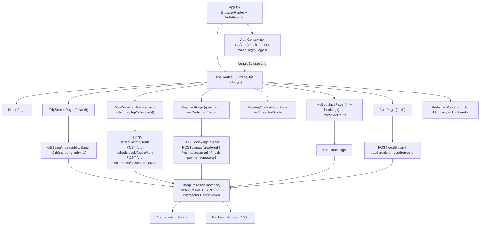
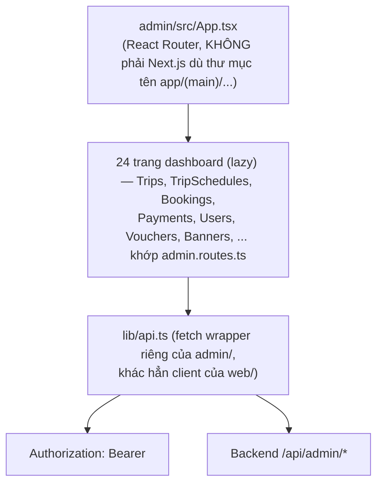

# 02 — Frontend Architecture (web/)

Nguồn: `web/src/App.tsx`, `web/src/lib/api.ts`, `web/src/contexts/AuthContext.tsx`.

## Chuỗi thật: Page → Component → State → API Client → Backend

## Danh sách route thật (từ `App.tsx`)

| Path | Component | Bảo vệ |
|---|---|---|
| `/` | HomePage | công khai |
| `/search` | TripSearchPage | công khai |
| `/seat-selection/:tripScheduleId` | SeatSelectionPage | công khai (ẩn Header/Footer) |
| `/payment` | PaymentPage | `ProtectedRoute` |
| `/booking-confirmation` | BookingConfirmationPage | `ProtectedRoute` |
| `/payment/vnpay-result`, `/momo-result`, `/mock-gateway`, `/mock-result`, `/bank-transfer` | các trang kết quả cổng thanh toán | `ProtectedRoute` |
| `/auth`, `/forgot-password`, `/reset-password`, `/complete-profile` | AuthPage và các biến thể | công khai |
| `/profile`, `/my-bookings` | ProfilePage, MyBookingsPage | `ProtectedRoute` |
| `/offers`, `/notifications`, `/about`, `/contact`, `/blog`, `/blog/:slug`, `/schedule`, `/loyalty` | trang nội dung | công khai |
| `/delivery`, `/rental`, `/tour`, `/tours`, `/tour/:id`, `/hotels`, `/hotels/:slug`, `/events` | dịch vụ phụ (nhóm `features/services`) | công khai |
| `/destinations/:slug` | DestinationDetailPage | công khai |

`features/admin/` tồn tại trong `web/src/features` nhưng **không có route nào trong App.tsx trỏ tới nó** → `[UNUSED]`.

## API client — có 2 lớp song song

- `web/src/lib/api.ts` — axios instance, **được 21 file import**, đây là client thật đang dùng.
- `web/src/shared/api/apiClient.ts` — class `ApiError` + `fetch` wrapper riêng, cùng chức năng, **0 file import** → `[UNUSED]`.

## State management thật

- Không có Redux/Zustand/Context API tổng quát ở `web/` — chỉ có **1 Context**: `AuthContext.tsx` (`useAuth()`), cung cấp `user`, `token`, `login`, `logout`, `updateUser`.
- Không có thư mục `hooks/` dùng chung — mỗi page tự gọi `api` (từ `lib/api.ts`) trong `useEffect`/handler, không tách custom hook riêng theo domain (không có `useBooking`, `useSeatMap`... như một layer riêng).
- Ghế đang chọn/giữ được quản lý bằng state cục bộ trong `SeatSelectionPage.tsx` (`setInterval` đếm ngược `timeLeft`), không đồng bộ qua socket — khớp với phát hiện ở `00-master-system-map.md` rằng frontend không dùng Socket.IO.

## admin/ — luồng tương tự nhưng độc lập hoàn toàn

