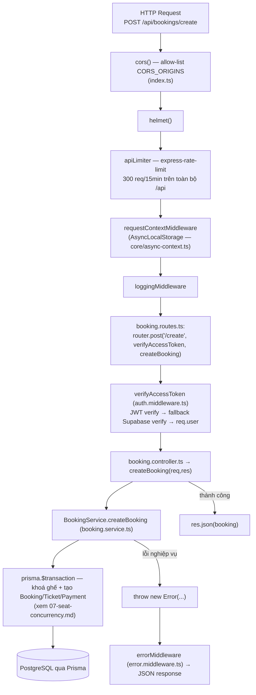

# 03 — Backend Architecture

Nguồn: `backend/src/index.ts`, `middleware/*`, `modules/*`.

## Chuỗi thật cho một request có auth (ví dụ tạo booking)



## Middleware thật (tên chính xác)

| Middleware | File | Vai trò |
|---|---|---|
| `verifyAccessToken` | `middleware/auth.middleware.ts` | Xác thực JWT (`jsonwebtoken`); nếu verify thất bại, fallback gọi `supabaseAdmin.auth.getUser(token)`; có dev-bypass khi `NODE_ENV=development && ALLOW_DEV_AUTH_FALLBACK=true` (tự đăng nhập user đầu tiên trong DB) |
| `optionalAuth` | cùng file | Giống trên nhưng không bắt buộc — dùng cho `GET /:tripScheduleId/seats` để cá nhân hoá ghế "held-by-me" nếu có đăng nhập |
| `requireAdmin` | `middleware/admin.middleware.ts` | Chặn nếu `req.user.role !== 'admin'` — áp cho toàn bộ `admin.routes.ts` qua `router.use(requireAdmin)` |
| `requestContextMiddleware` | `middleware/request-context.middleware.ts` | Gắn context request vào AsyncLocalStorage |
| `loggingMiddleware`, `errorMiddleware` | tương ứng | Log request, format lỗi JSON cuối chuỗi |
| `apiLimiter` / `authLimiter` | khai báo trực tiếp trong `index.ts` | Rate-limit chung `/api` (300/15min) và riêng `/api/auth` (20/15min chống brute-force) |

## Bản đồ Controller / Service theo module (chỉ module có tách lớp)

| Module | Route file | Controller | Service | Ghi chú |
|---|---|---|---|---|
| booking | `booking.routes.ts` | `booking.controller.ts` | `BookingService` (`booking.service.ts`) | transaction tạo/huỷ booking |
| seat | `seat.routes.ts` | `seat.controller.ts` | `SeatService` (`seat.service.ts`) | seat map + hold/release |
| payment | `payment.routes.ts` | `payment.controller.ts` | `PaymentService` (`payment.service.ts`, nhận `PrismaClient` qua constructor — module duy nhất dùng dependency injection kiểu này) | |
| wallet | `wallet.routes.ts` | `WalletController` (`wallet.controller.ts`) | `wallet.service.ts` | |
| loyalty | `loyalty.routes.ts` | `LoyaltyController` (`loyalty.controller.ts`) | `loyalty.service.ts` | |
| ai | `ai.routes.ts` | `ai.controller.ts` (`chatWithAi`) | `ai.service.ts` → `ai.tools.ts` (RAG context) + `ai.prompt.ts` | gọi Ollama, không tách repository |

Các module còn lại (`tour`, `destination`, `hotel`, `rental`, `delivery`, `banner`, `hero`, `contact`, `event`) **không tách controller/service** — logic Prisma nằm thẳng trong `<name>.routes.ts`.

## Không có tầng "Repository" riêng

Toàn bộ truy vấn dùng trực tiếp `PrismaClient` (`import { prisma } from '../../core/prisma'` hoặc `new PrismaClient()` cục bộ trong từng file — nhiều module tự khởi tạo `PrismaClient` riêng thay vì dùng singleton `core/prisma.ts`, ví dụ `payment.service.ts`, `vnpay.routes.ts`, `momo.routes.ts`, `bank-transfer.routes.ts`, `admin.routes.ts` đều có `const prisma = new PrismaClient()` riêng — không phải bug chức năng nhưng là nhiều connection pool cùng lúc).

## Admin CRUD engine — `createCrudRouter` (admin.routes.ts)

Một factory tạo REST CRUD generic (`GET /`, `GET /:id`, `POST /`, `PUT /:id`, `DELETE /:id`) theo convention `range`/`sort`/`filter` + header `Content-Range`/`X-Total-Count` — đúng chuẩn simple-REST data provider. Được mount cho 24 Prisma delegate:

```text
/api/admin/users, /bookings, /trips, /tripSchedules, /seats, /busAgents, /buses,
/employees, /promotions, /cities, /routes, /wallets, /walletTransactions, /banners,
/destinations, /heroSlides, /hotels, /events, /appConfigs, /reviews, /tours,
/tourBookings, /rentalCars, /rentalBookings, /deliveryOrders, /payments
```

`createCrudRouter` tự strip field `password` đệ quy khỏi mọi response (`ALWAYS_STRIP`) và chặn field nhạy cảm khỏi body ghi (`writeBlock`) — chống mass-assignment leo quyền qua `role`.

## Vòng lặp nền (không phải request-response)

`index.ts` (chỉ chạy khi `require.main === module`, tức là chạy server thật chứ không phải khi import để test):

```ts
setInterval(() => BookingService.releaseExpiredBookings(BOOKING_EXPIRY_MINUTES), 5 * 60 * 1000);
```

Cứ mỗi 5 phút, nhả ghế của các `Booking` ở trạng thái `PENDING_PAYMENT` quá hạn (`BOOKING_EXPIRY_MINUTES`, mặc định 30 phút).
