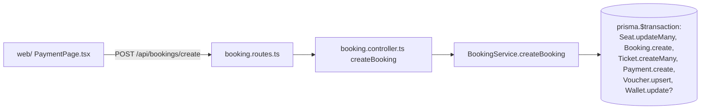

# 04 — API Map (toàn bộ endpoint thật)

Lấy từ `grep` trực tiếp trên `router.get/post/put/patch/delete(...)` trong `backend/src`. Base path mount trong `index.ts`.

## Public (đăng ký thẳng trong `index.ts`, không qua modules/)

| Method | Path | Xử lý | DB |
|---|---|---|---|
| GET | `/health` | inline | `SELECT 1` |
| GET | `/api/trips` | inline, cache `getCached` | `Route`, `Trip`, `TripSchedule`, `TripPrice`, `Checkpoint` |
| GET | `/api/promotions` | inline, cache | `Promotion` |
| GET | `/api/promotions/validate/:code` | inline, `verifyAccessToken` | `Promotion`, `Voucher` |
| GET | `/api/reviews` | inline | `Review`, `User`, `Trip` |
| GET | `/api/stations` | inline, cache | `Station`, `City` |
| GET | `/api/configs` | inline, cache | `AppConfig` |

## `/api/auth` (`auth.routes.ts`, qua `authLimiter`)

| Method | Path | Auth |
|---|---|---|
| POST | `/register` | công khai |
| POST | `/login` | công khai |
| POST | `/google` | công khai (google-auth-library) |
| POST | `/forgot-password` | công khai |
| POST | `/reset-password` | công khai |
| GET | `/profile` | `verifyAccessToken` |
| PUT | `/profile` | `verifyAccessToken` |
| POST | `/login/verify-otp` | công khai (cần `challengeId` hợp lệ) — **mới, commit `931302a`**, hoàn tất đăng nhập khi `/login` trả `requiresOtp: true` |

> `POST /register` từ commit `931302a` **bắt buộc** `otpChallengeId` + `otpCode` (xin qua `/api/identity/otp/request-registration`) — xem [14-identity-otp-flow.md](14-identity-otp-flow.md).
> `POST /login` có thể trả `{ requiresOtp: true, challengeId }` thay vì token nếu thiết bị chưa có `DeviceSession` hợp lệ — xem file 14.

## `/api/identity` (`identity.routes.ts` — mới, commit `931302a`, qua `otpLimiter` 20 req/15p)

| Method | Path | Auth |
|---|---|---|
| POST | `/otp/request` | công khai |
| POST | `/otp/request-registration` | công khai |
| POST | `/otp/request-admin` | công khai (chỉ gửi mã thật nếu email đã có role=admin) |
| POST | `/otp/verify` | công khai |
| POST | `/lookup-order` | công khai |
| GET | `/session` | cookie `anchuyen_device_session` |
| POST | `/logout` | cookie `anchuyen_device_session` |

Chi tiết đầy đủ luồng, middleware `deviceSessionAuth`/`requireAnyIdentity`/`guestBookingIdentity` (gắn vào `POST /bookings/create` và `POST/:id/seats/hold|release`) — xem [14-identity-otp-flow.md](14-identity-otp-flow.md).

## `/api/bookings` (`booking.routes.ts` → `booking.controller.ts` → `BookingService`)

| Method | Path | Handler |
|---|---|---|
| POST | `/create` | `createBooking` → `BookingService.createBooking` |
| GET | `/` | `getBookings` |
| POST | `/:id/cancel` | `cancelBooking` → `BookingService.cancelBooking` |

## `/api/trip-schedules` (mount của `seat.routes.ts`)

| Method | Path | Handler | Auth |
|---|---|---|---|
| GET | `/:tripScheduleId` | `getTripScheduleDetail` | công khai |
| GET | `/:tripScheduleId/seats` | `getSeatMap` | `optionalAuth` |
| POST | `/:tripScheduleId/seats/hold` | `holdSeats` → `SeatService.holdSeats` | `verifyAccessToken` |
| POST | `/:tripScheduleId/seats/release` | `releaseSeats` → `SeatService.releaseSeats` | `verifyAccessToken` |

## `/api/payments` (`payment.routes.ts` → `PaymentService`)

| Method | Path | Auth |
|---|---|---|
| POST | `/create` | user |
| GET | `/:paymentId` | user |
| GET | `/booking/:bookingId` | user |
| PATCH | `/:paymentId/status` | user + `requireAdmin` |
| POST | `/cod/confirm` | user + `requireAdmin` |
| POST | `/admin/reject` | user + `requireAdmin` |
| GET | `/admin/pending` | user + `requireAdmin` |

## Cổng thanh toán riêng

| Prefix | Endpoint | Vai trò |
|---|---|---|
| `/api/vnpay` | `POST /create-url` (auth), `GET /return` (redirect khách), `GET /ipn` (server-to-server) | `vnpay.util.ts` ký/verify HMAC |
| `/api/momo` | `POST /create-url` (auth), `GET /return`, `POST /ipn` | `momo.util.ts` |
| `/api/mock-payment` | `POST /create-url` (auth), `POST /confirm` (auth) | Cổng giả lập cho dev/test |
| `/api/bank-transfer` | `GET /info`, `POST /webhook/sepay`, `POST /webhook/casso` | VietQR + webhook đối soát tự động |

Tất cả cùng gọi `confirmPaymentSuccess(bookingId, gateway, transactionId)` / `markPaymentFailed(bookingId)` trong `confirm.util.ts` — điểm hội tụ duy nhất chuyển `Payment.status → PAID` + `Booking.status → CONFIRMED` + ghế `→ BOOKED`.

## `/api/loyalty`, `/api/wallet`

| Method | Path | Handler | Auth |
|---|---|---|---|
| GET | `/api/loyalty/me` | `LoyaltyController.getMyLoyalty` | user |
| POST | `/api/loyalty/add` | `LoyaltyController.addPoints` | **không có middleware auth** `[MISSING]` — route cộng điểm loyalty không yêu cầu token, khác các route khác cùng module |
| GET | `/api/wallet/me` | `WalletController.getMyWallet` | user |

## `/api/ai`

| Method | Path | Handler |
|---|---|---|
| POST | `/chat` | `chatWithAi` → `ai.service.ts` (gọi Ollama, không yêu cầu auth) |

## Nội dung tĩnh — mỗi module 1 file routes, không controller/service riêng

| Prefix | Method + Path | Model |
|---|---|---|
| `/api/tours` | GET `/`, GET `/:id`, POST `/book` | `Tour`, `TourBooking` |
| `/api/destinations` | GET `/`, GET `/:slug` | `Destination` |
| `/api/hotels` | GET `/`, GET `/:slug` | `Hotel` |
| `/api/rentals` | GET `/cars`, POST `/book` | `RentalCar`, `RentalBooking` |
| `/api/deliveries` | GET `/vehicles`, POST `/book` | `DeliveryVehicle`, `DeliveryOrder` |
| `/api/banners` | GET `/` | `Banner` |
| `/api/hero-slides` | GET `/` | `HeroSlide` |
| `/api/events` | GET `/` | `Event` |
| `/api/contacts` | GET `/` (auth) | `Contact` |

## `/api/admin` (toàn bộ sau `verifyAccessToken` + `requireAdmin`)

Route tuỳ biến:

| Method | Path |
|---|---|
| POST | `/invite-user` |
| POST | `/tripSchedules/:id/generate-seats` |
| GET | `/tripSchedules/:id/vehicle-detail` |
| PUT | `/tripSchedules/:id/assign` |
| POST | `/users/:id/wallet/topup` |
| GET | `/stats` |
| GET | `/analytics/overview` |
| GET | `/support/conversations` |
| GET | `/support/conversations/:id/messages` |
| POST | `/support/conversations/:id/messages` |
| PATCH | `/support/conversations/:id` |

CRUD generic (`GET /`, `GET /:id`, `POST /`, `PUT /:id`, `DELETE /:id` cho mỗi prefix): `/users`, `/bookings`, `/trips`, `/tripSchedules`, `/seats`, `/busAgents`, `/buses`, `/employees`, `/promotions`, `/cities`, `/routes`, `/wallets`, `/walletTransactions`, `/banners`, `/destinations`, `/heroSlides`, `/hotels`, `/events`, `/appConfigs`, `/reviews`, `/tours`, `/tourBookings`, `/rentalCars`, `/rentalBookings`, `/deliveryOrders`, `/payments`.

## Ví dụ chuỗi đầy đủ Frontend → DB (endpoint quan trọng nhất)

