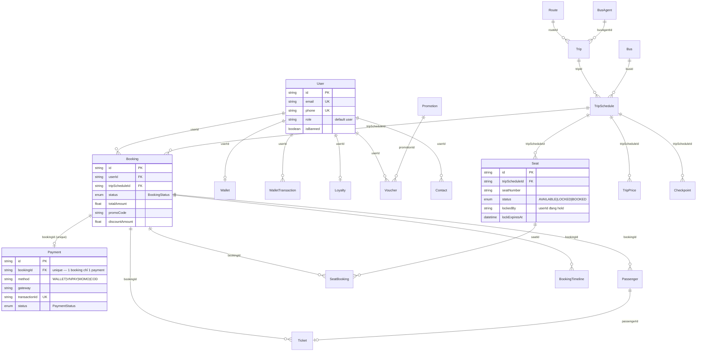

# 05 — Database Map (ERD từ `backend/prisma/schema.prisma`)

49 model, 7 enum, PostgreSQL qua Supabase (`DATABASE_URL` + `DIRECT_URL`).

## ERD lõi — luồng đặt vé (đầy đủ field khoá)



`Seat.@@unique([tripScheduleId, seatNumber])` — ràng buộc DB đảm bảo không tạo trùng số ghế trên cùng 1 chuyến (không phải cơ chế chống double-booking — xem `07-seat-concurrency.md`).
`Payment.bookingId @unique` — ràng buộc 1-1 thật giữa Booking và Payment, khớp với `payment.service.ts` việc kiểm tra "Payment for booking already exists" trước khi tạo mới.

## Nhóm model đầy đủ (49 model)

| Nhóm | Model |
|---|---|
| Người dùng & phiên | `User`, `Profile`, `DeviceSession`, `PasswordResetToken` |
| Ví & thanh toán | `Wallet`, `WalletTransaction`, `Payment`, `UserPaymentMethod` |
| Ưu đãi | `Loyalty`, `LoyaltyHistory`, `Promotion`, `Voucher` |
| Địa lý & tuyến | `Province`, `City`, `Station`, `Route` |
| Đội xe & nhân sự | `BusAgent`, `Bus`, `BusImage`, `Facility`, `BusFacility`, `Employee`, `TripStaffAssignment`, `CancellationPolicy` |
| Chuyến đi | `Trip`, `TripSchedule`, `Checkpoint`, `TripPrice`, `SeatType`, `Seat` |
| Đặt vé | `Booking`, `BookingTimeline`, `SeatBooking`, `Passenger`, `Ticket`, `Review` |
| Nội dung trang khách | `Banner`, `HeroSlide`, `Destination`, `Hotel`, `Event`, `SearchHistory`, `Contact`, `AppConfig` |
| Dịch vụ khác | `RentalCar`, `RentalBooking`, `Tour`, `TourBooking`, `Parcel`, `DeliveryOrder`, `DeliveryVehicle` |
| Hỗ trợ khách hàng | `SupportConversation`, `SupportMessage` |

## Enum thật (giá trị chính xác từ schema)

```text
enum Gender          { MALE, FEMALE, OTHER }
enum BookingStatus   { DRAFT, PENDING_PAYMENT, CONFIRMED, COMPLETED, CANCELLED, REFUNDING, REFUNDED }
enum PaymentStatus   { PENDING, PROCESSING, PAID, FAILED, REFUNDED }
enum SeatStatus      { AVAILABLE, LOCKED, BOOKED }
enum SeatClass       { ECONOMY, EXECUTIVE, SUPER_EXECUTIVE, VIP, SLEEPER }
enum ParcelStatus    { PENDING, ACCEPTED, IN_TRANSIT, DELIVERED, CANCELLED }
enum TransactionType { ... (loại giao dịch ví) }
```

Đối chiếu giá trị enum có **thật sự được set ở đâu đó trong code** hay không — xem `06-booking-flow.md` mục "state machine thật".
