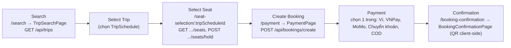
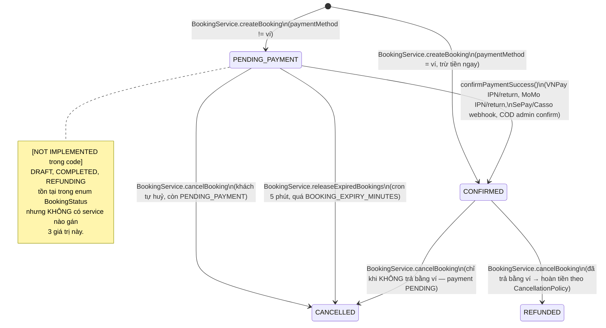

# 06 — Booking Flow & State Machine

Nguồn: `web/src/App.tsx` (route thật), `backend/src/modules/booking/booking.service.ts`, `backend/prisma/schema.prisma` (`BookingStatus`).

## Business flow thật (khớp route Frontend)

## State machine THẬT (chỉ transition có code, không suy đoán từ enum)

## Đối chiếu enum ↔ code thật

| `BookingStatus` | Có được set không? | Nơi set |
|---|---|---|
| `PENDING_PAYMENT` | ✅ | `BookingService.createBooking` (mặc định trừ khi ví) |
| `CONFIRMED` | ✅ | `createBooking` (ví), `confirm.util.ts::confirmPaymentSuccess`, `payment.service.ts::updatePaymentStatus/confirmCODPayment` |
| `CANCELLED` | ✅ | `cancelBooking`, `releaseExpiredBookings` |
| `REFUNDED` | ✅ | `cancelBooking` (khi đã trả bằng ví) |
| `DRAFT` | `[NOT IMPLEMENTED]` | không tìm thấy |
| `COMPLETED` | `[NOT IMPLEMENTED]` | chỉ xuất hiện trong 1 điều kiện đọc ở `booking.controller.ts:144` và 1 unit test — không có job nào đánh dấu chuyến đã hoàn thành/khách đã đi xe xong |
| `REFUNDING` | `[NOT IMPLEMENTED]` | không tìm thấy — hoàn tiền qua ví là tức thời trong cùng transaction huỷ, không có bước "đang xử lý hoàn tiền" |

## Chi tiết `BookingService.createBooking` (transaction 8 bước thật)

1. Tìm `TripSchedule`, throw nếu không tồn tại.
2. Tìm `Seat` theo `seatNumbers` — throw nếu thiếu ghế trong sơ đồ (không tự tạo ghế).
3. Kiểm tra từng ghế `AVAILABLE` hoặc đang `LOCKED` bởi chính `userId` (hold trước đó) — không đủ điều kiện thì throw.
4. Tự tính `totalAmount` từ `TripPrice` theo VIP/ECONOMY (suy ra VIP từ số hàng ghế) + phí dịch vụ 10.000đ — **không tin số tiền client gửi lên**.
5. Áp mã giảm giá nếu có: tra `Promotion`, kiểm tra còn hạn/active, kiểm tra `Voucher` chưa dùng (unique `userId_promotionId`).
6. Nếu thanh toán bằng ví (`busz-wallet`/`WALLET`/`wallet`): kiểm tra đủ số dư — không đủ thì rollback toàn bộ.
7. **Khoá ghế bằng `updateMany` có điều kiện** (`status: AVAILABLE OR (LOCKED AND lockedBy=userId)`) — đây là bước chống race condition thật sự (xem `07-seat-concurrency.md`).
8. Tạo `Booking` + `Passenger[]` + `SeatBooking[]` + `Ticket[]` (`status: PENDING`) + `Payment` (nếu có `paymentMethod`) + trừ ví nếu cần + upsert `Contact` — tất cả trong cùng `$transaction` (`maxWait: 15s`, `timeout: 30s`).

## `cancelBooking` — hoàn tiền theo chính sách nhà xe

Đọc `CancellationPolicy` của `BusAgent` (sắp theo `hoursBefore` giảm dần), tìm policy đầu tiên có `hoursBefore <= giờ còn lại tới khởi hành`, áp `refundPct` lên `totalAmount`. Chỉ hoàn tiền nếu đã thanh toán bằng ví; các phương thức khác chỉ đổi `Payment.status → FAILED` nếu đang `PENDING` (không tự động hoàn tiền qua gateway — hợp lý vì VNPay/MoMo hoàn tiền cần gọi API refund riêng, **hiện không có code gọi API refund của VNPay/MoMo** → `[NOT IMPLEMENTED]`).
