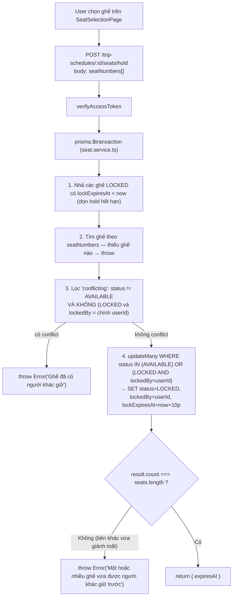
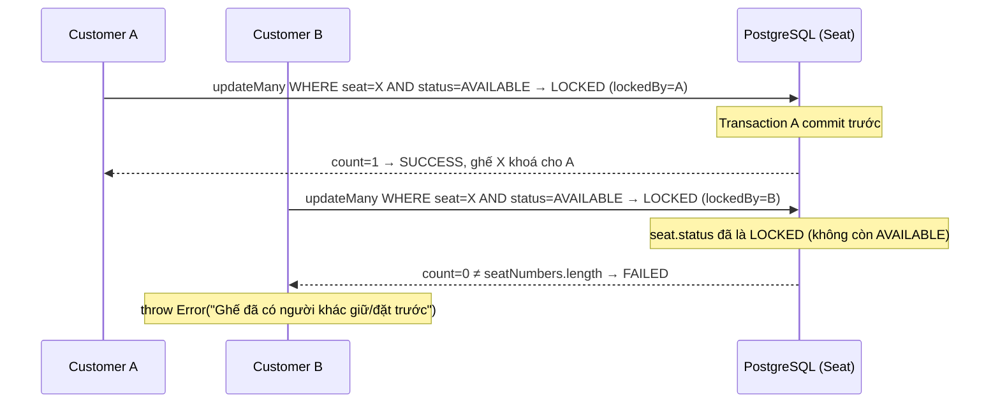

# 07 — Seat Lock & Concurrency (truy vết thật từ `seat.service.ts` + `booking.service.ts`)

Có **2 cơ chế khoá riêng biệt**, không dùng Redis, không dùng Socket.IO, không dùng `SELECT ... FOR UPDATE` — toàn bộ dựa vào Prisma `$transaction` + `updateMany` có điều kiện (optimistic, dựa vào `count` trả về khớp số lượng mong đợi).

## Cơ chế 1 — Hold tạm khi đang chọn ghế (`SeatService.holdSeats`, 10 phút)

## Cơ chế 2 — Khoá thật khi tạo Booking (`BookingService.createBooking`, bước 3 trong 06-booking-flow.md)

Cùng pattern `updateMany` có điều kiện + so `count`, nhưng set `status: BOOKED` (nếu trả bằng ví) hoặc `LOCKED` (chờ gateway xác nhận) — và **xoá `lockExpiresAt`** để ghế không còn phụ thuộc cơ chế hold 10 phút nữa (khoá "vĩnh viễn" cho tới khi có `confirmPaymentSuccess`/`releaseExpiredBookings`).

## Trường hợp bắt buộc: 2 khách cùng chọn 1 ghế

Đây **không phải pessimistic lock kiểu `SELECT FOR UPDATE`** — đúng ra là **conditional update kiểu optimistic**: điều kiện `status = AVAILABLE` trong mệnh đề `WHERE` của `updateMany` khiến PostgreSQL tự nhiên chỉ cho 1 trong 2 transaction cập nhật trúng dòng (row-level lock ngầm của chính câu `UPDATE`), và phía Node kiểm tra `count` để biết mình có thắng hay không.

## Những gì có thật / không có thật liên quan seat lock

| Cơ chế | Trạng thái |
|---|---|
| Prisma `$transaction` | ✅ có thật (`booking.service.ts`, `seat.service.ts`) |
| `updateMany` điều kiện + so `count` (atomic) | ✅ có thật — chống trùng ghế |
| `@@unique([tripScheduleId, seatNumber])` (DB constraint) | ✅ có thật — chặn tạo trùng số ghế, không phải cơ chế lock |
| `lockExpiresAt` (hold hết hạn) | ✅ có thật, tự dọn ở đầu mỗi lần gọi `getSeatMap`/`holdSeats` (không có cron riêng cho hold, chỉ dọn "lazy" khi có request mới) |
| Redis / distributed lock | `[NOT IMPLEMENTED]` — không có redis trong dependency |
| `SELECT ... FOR UPDATE` tường minh | `[NOT IMPLEMENTED]` — dựa hoàn toàn vào `updateMany` |
| Socket.IO broadcast khi ghế bị khoá/nhả (`seat:locked`, `seat:released`) | `[NOT IMPLEMENTED]` — `core/socket.ts` không có event nào tên liên quan tới ghế |
| Frontend polling lại seat map để thấy ghế người khác vừa khoá | Có `setInterval` trong `SeatSelectionPage.tsx` nhưng chỉ dùng để đếm ngược `timeLeft` của ghế đang giữ — không thấy gọi lại `GET .../seats` định kỳ để đồng bộ ghế người khác → cập nhật ghế real-time giữa nhiều khách **`[NOT IMPLEMENTED]`**, khách chỉ biết ghế bị người khác giành khi chính họ bấm hold/tạo booking và nhận lỗi. |
