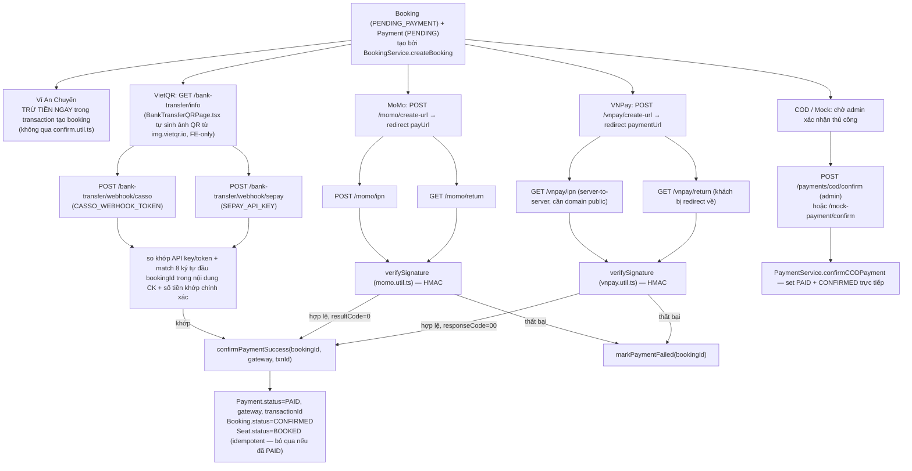
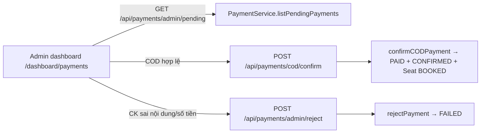

# 08 — Payment Flow (5 phương thức thật)

Nguồn: `payment.routes.ts`, `vnpay.routes.ts`, `momo.routes.ts`, `mock-gateway.routes.ts`, `bank-transfer.routes.ts`, `confirm.util.ts`.

## Sơ đồ tổng — điểm hội tụ `confirm.util.ts`

## Webhook — thật, có điều kiện, không phải thành phần đang "chạy sẵn"

Cả 2 webhook `sepay` và `casso` **chỉ hoạt động khi biến môi trường được cấu hình** (`SEPAY_API_KEY`, `CASSO_WEBHOOK_TOKEN`) — nếu thiếu, route trả lỗi 500 ngay, không silent-fail. Không có webhook nào cho VNPay/MoMo ngoài IPN đã liệt kê ở trên (IPN chính là dạng webhook của 2 cổng này).

## Đối soát nội dung chuyển khoản (VietQR)

`bank-transfer.routes.ts` regex `AC\s*([A-F0-9]{8})` khớp 8 ký tự đầu của `bookingId` được nhúng vào nội dung chuyển khoản khi sinh mã QR (`BankTransferQRPage.tsx`, phía frontend). Amount phải khớp **chính xác** `Math.round(booking.totalAmount)` — sai lệch thì bỏ qua, không tự xác nhận, chờ admin xử lý thủ công.

## `PaymentMethod`/`PaymentStatus` thật được set ở đâu

| Trạng thái | Set bởi |
|---|---|
| `Payment.status = PENDING` | `BookingService.createBooking` bước 6 (khi `paymentMethod` khác ví) |
| `Payment.status = PAID` (ví) | `createBooking` (trực tiếp, cùng transaction, không qua `confirm.util.ts`) |
| `Payment.status = PAID` (khác) | `confirmPaymentSuccess` (VNPay/MoMo/SePay/Casso) hoặc `PaymentService.confirmCODPayment` (admin) |
| `Payment.status = FAILED` | `markPaymentFailed` (VNPay/MoMo thất bại), `PaymentService.rejectPayment` (admin từ chối thủ công), `cancelBooking`/`releaseExpiredBookings` (khi huỷ booking còn PENDING) |
| `Payment.status = REFUNDED` | chỉ set trong `BookingService.cancelBooking` khi đã trả bằng ví — **không có refund thật qua API VNPay/MoMo** `[NOT IMPLEMENTED]` |
| `Payment.status = PROCESSING` | `[NOT IMPLEMENTED]` — có trong enum `PaymentStatus` nhưng không có chỗ nào gán |

## Admin duyệt thanh toán thủ công

