# 09 — Admin Flow

Nguồn: `admin/src/App.tsx` (route thật) đối chiếu `backend/src/admin.routes.ts`.

## Sơ đồ — trang admin thật ↔ endpoint thật

```mermaid
flowchart TD
    ADMIN["Admin đăng nhập\n/auth/login → admin/src/app/(main)/auth/v2/login/page.tsx"]
    ADMIN -->|"POST /api/auth/login\n(role phải = admin để qua requireAdmin)"| DASH["Dashboard (admin/src/App.tsx routes)"]

    DASH --> TRIPS["TripsPage ↔ /api/admin/trips (CRUD)"]
    DASH --> SCHED["TripSchedulesPage ↔ /api/admin/tripSchedules\n+ POST /tripSchedules/:id/generate-seats\n+ GET /tripSchedules/:id/vehicle-detail\n+ PUT /tripSchedules/:id/assign"]
    DASH --> BOOKINGS["BookingsPage ↔ /api/admin/bookings (CRUD)"]
    DASH --> PAYMENTS["PaymentsPage ↔ /api/admin/payments (CRUD)\n+ /api/payments/admin/pending, /cod/confirm, /admin/reject"]
    DASH --> USERS["UsersPage ↔ /api/admin/users (CRUD)\n+ POST /invite-user (Supabase Auth)\n+ POST /users/:id/wallet/topup"]
    DASH --> VEHICLES["VehiclesPage ↔ /api/admin/buses"]
    DASH --> BUSAGENTS["BusAgentsPage ↔ /api/admin/busAgents"]
    DASH --> ROUTES["RoutesPage ↔ /api/admin/routes"]
    DASH --> EMPLOYEES["EmployeesPage ↔ /api/admin/employees"]
    DASH --> VOUCHERS["VouchersPage ↔ /api/admin/promotions (không có endpoint /vouchers riêng —\nquản lý qua Promotion, Voucher chỉ đọc-ghi từ phía user)"]
    DASH --> BANNERS["BannersPage ↔ /api/admin/banners"]
    DASH --> DESTINATIONS["DestinationsPage ↔ /api/admin/destinations"]
    DASH --> HERO["HeroSlidesPage ↔ /api/admin/heroSlides"]
    DASH --> EVENTS["EventsPage ↔ /api/admin/events"]
    DASH --> REVIEWS["ReviewsPage ↔ /api/admin/reviews"]
    DASH --> TOURS["ToursPage ↔ /api/admin/tours + /tourBookings"]
    DASH --> HOTELS["HotelsAdminPage ↔ /api/admin/hotels"]
    DASH --> RENTALS["RentalsPage ↔ /api/admin/rentalCars + /rentalBookings"]
    DASH --> DELIVERIES["DeliveriesPage ↔ /api/admin/deliveryOrders"]
    DASH --> ANALYTICS["AnalyticsPage ↔ /api/admin/analytics/overview + /stats"]
    DASH --> WEBSITECONFIG["WebsiteConfigPage ↔ /api/admin/appConfigs"]
    DASH --> CHAT["ChatAppPage (/chat) ↔ /api/admin/support/conversations\n+ /support/conversations/:id/messages (GET/POST)\n+ PATCH /support/conversations/:id"]
```

## Route admin có trang FE nhưng KHÔNG có resource CRUD riêng ở backend

- `VouchersPage` — không có `router.use('/vouchers', ...)` trong `admin.routes.ts`; `Voucher` chỉ được ghi từ `BookingService.createBooking` (redeem) — quản lý voucher từ phía admin thực chất là quản lý `Promotion`. `[MISSING]` nếu kỳ vọng CRUD riêng cho từng voucher đã phát hành.
- `SettingsPage`, `ProfilePage` (admin/src) — trang cấu hình cá nhân/giao diện, dùng `stores/preferences` (Zustand, client-side only), không gọi API backend nào tương ứng.

## Xác thực admin — khác cơ chế với web/

`admin/src/lib/api.ts` lưu token ở `localStorage.getItem("admin_token")` (khác `web/` dùng `sessionStorage` key `busz_token`) — 2 ứng dụng có 2 phiên đăng nhập độc lập, không chia sẻ session dù cùng gọi `/api/auth/login`. Phân quyền admin dựa vào `req.user.role === 'admin'` (cùng bảng `User`, không có bảng "Admin" riêng).
