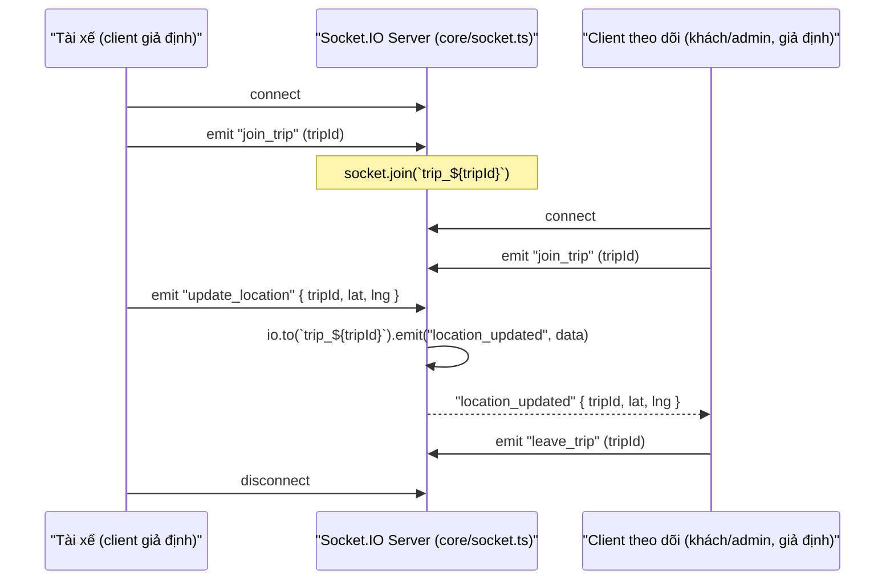

# 10 — Realtime Flow (Socket.IO)

Nguồn: `backend/src/core/socket.ts`, `backend/src/index.ts` (`initSocket(server)`), grep toàn repo cho `socket.io-client`.

## Sự thật: chỉ có 1 tính năng realtime, và chưa có ai tiêu thụ nó

## Event thật (tên chính xác, không suy đoán)

| Event | Chiều | Payload |
|---|---|---|
| `join_trip` | client → server | `tripId: string` |
| `leave_trip` | client → server | `tripId: string` |
| `update_location` | client → server | `{ tripId: string, lat: number, lng: number }` |
| `location_updated` | server → room `trip_${tripId}` | cùng payload trên |

## `[NOT IMPLEMENTED]` — không có event nào cho:

- `seat:locked` / `seat:released` / `seat:updated` (đặt/nhả ghế realtime)
- Trạng thái booking/payment đổi realtime (khách phải tự polling hoặc reload trang kết quả thanh toán)
- Chat hỗ trợ realtime (`SupportConversation`/`SupportMessage` — `admin.routes.ts` có endpoint REST GET/POST cho tin nhắn, **không có socket event nào phát tin nhắn mới**, nghĩa là chat trong `admin/src/app/(main)/chat` phải tự polling nếu muốn gần-realtime, hoặc chỉ hiển thị khi F5/gọi lại API)

## `[NOT IMPLEMENTED]` — không có consumer nào ở frontend

Không có `socket.io-client` trong `web/package.json` hay `admin/package.json`, và không có lệnh gọi `io(...)` nào trong `web/src` hay `admin/src`. Toàn bộ hạ tầng `core/socket.ts` hiện tại là **backend đã build sẵn cho theo dõi GPS xe (map trực tiếp trên UI) nhưng chưa có UI nào kết nối tới nó** — tính năng "xem xe đang chạy tới đâu trên bản đồ" nêu trong ý tưởng sản phẩm chưa hoàn thiện đầu cuối.
