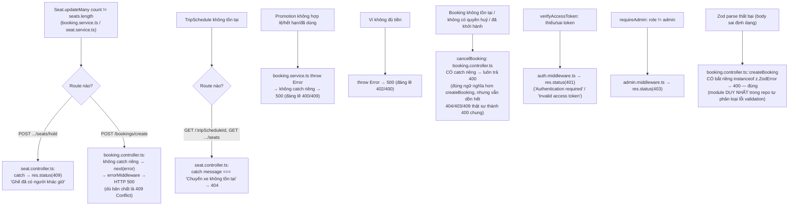

# 11 — Error & Edge Cases (truy vết thật từ controller/service/zod)

## Validation đầu vào — chỉ `booking.controller.ts` dùng Zod

`createBookingSchema` (Zod) kiểm tra: `tripScheduleId` là UUID, `seatNumbers` 1-10 phần tử, `passengers` tên ≥2 ký tự, `promoCode`/`contactEmail` đúng định dạng — **backend luôn bỏ qua `totalAmount` client gửi** (tự tính lại). Đây là module duy nhất dùng `zod` cho validate; các module còn lại (`tour`, `hotel`, `rental`...) không có lớp validate — nếu body sai kiểu, lỗi rơi thẳng xuống Prisma rồi bị `errorMiddleware` trả về 500 kèm message kỹ thuật của Prisma (`[MISSING]` — rò rỉ chi tiết lỗi DB ra ngoài client trong production, vì `errorMiddleware` chỉ ẩn `stack`, không ẩn `err.message`).

## Bản đồ lỗi thật ↔ HTTP status ↔ nơi xử lý

## `[MISSING]` quan trọng: hầu hết lỗi nghiệp vụ trả về HTTP 500 thay vì 4xx

`errorMiddleware` (`middleware/error.middleware.ts`) **luôn trả `res.status(500)`** bất kể loại lỗi — không phân biệt "lỗi nghiệp vụ hợp lệ" (hết ghế, hết hạn mã giảm giá, thiếu quyền) với "lỗi hệ thống thật" (crash, mất kết nối DB). Chỉ 3 nơi tự bắt lỗi và trả đúng status:

| Trường hợp | Status trả về | Đúng theo REST? |
|---|---|---|
| `POST .../seats/hold` bị giành ghế / ghế không tồn tại / thua race | 409 (mọi lỗi trong catch đều 409, kể cả "ghế không tồn tại" đáng lẽ 404) | ⚠️ nhất quán nhưng gộp chung |
| `GET /:tripScheduleId` không tồn tại | 404 | ✅ |
| `verifyAccessToken` thiếu/sai token | 401 | ✅ |
| `requireAdmin` sai role | 403 | ✅ |
| `POST /bookings/create` — Zod validation error | 400 (bắt riêng `instanceof z.ZodError`) | ✅ |
| `POST /bookings/create` — lỗi nghiệp vụ khác (ghế đã đặt, mã giảm giá sai, ví không đủ tiền, thua race) đi qua `next(error)` | **500** | ❌ — nên là 409/400/402 |
| `POST /bookings/:id/cancel` — mọi lỗi (không tồn tại, không có quyền, sai trạng thái, đã khởi hành) đều bắt riêng | 400 | ⚠️ đúng hơn 500 nhưng gộp cả 404/403/409 thành 400 |
| VNPay/MoMo `return`/`ipn` — sai chữ ký, sai số tiền, thất bại | redirect riêng biệt / `RspCode` riêng biệt theo từng trường hợp | ✅ module xử lý lỗi tốt nhất trong repo |

## Concurrency / duplicate cụ thể tìm thấy trong code

| Tình huống | Cơ chế chống | File |
|---|---|---|
| 2 khách cùng giữ 1 ghế (hold) | `updateMany` điều kiện + so `count` | `seat.service.ts::holdSeats` |
| 2 khách cùng tạo Booking trên 1 ghế | `updateMany` điều kiện + so `count`, trong `$transaction` | `booking.service.ts::createBooking` bước 3 |
| Dùng trùng mã giảm giá 2 lần | `@@unique([userId, promotionId])` trên `Voucher` + kiểm tra `isUsed` trong transaction | `booking.service.ts` |
| Webhook thanh toán gọi lại nhiều lần (VNPay IPN + return cùng xử lý, hoặc webhook retry) | `confirmPaymentSuccess` kiểm tra `payment.status === 'PAID'` trước, trả `alreadyProcessed: true` thay vì xử lý lại | `confirm.util.ts` |
| Tạo Payment trùng cho 1 Booking | check `existingPayment` trước khi `create`, cộng thêm ràng buộc DB `Payment.bookingId @unique` | `payment.service.ts::createPayment` |
| Idempotency key khi tạo booking (`idempotencyKey` trong Zod schema) | **`[NOT IMPLEMENTED]`** — field được nhận và validate nhưng comment ngay trong code thừa nhận chưa lưu/kiểm tra nó: *"Ở đây ta đơn giản hóa để tập trung vào Lớp 1 & Lớp 2"* (`booking.service.ts`) |

## Timeout / hết hạn

| Cái gì hết hạn | Sau bao lâu | Ai dọn |
|---|---|---|
| Hold ghế khi đang chọn (chưa tạo Booking) | 10 phút (`SEAT_HOLD_MINUTES`) | Lazy — dọn mỗi khi có request mới tới `getSeatMap`/`holdSeats`, không có cron riêng |
| Booking `PENDING_PAYMENT` chưa thanh toán | `BOOKING_EXPIRY_MINUTES` (mặc định 30) | `setInterval` mỗi 5 phút trong `index.ts` gọi `BookingService.releaseExpiredBookings` |
| JWT access token | theo `JWT_SECRET`/thời hạn ký lúc login (không thấy refresh-token flow riêng trong `auth.routes.ts`) | Client tự nhận 401 và bị interceptor trong `lib/api.ts` đá về `/auth` |

## Lỗi do thiếu cấu hình (không phải bug logic, nhưng chặn hoàn toàn tính năng)

- VNPay/MoMo/BankTransfer trả `500`/`404` rõ ràng nếu thiếu biến môi trường tương ứng (`getVnpayConfig()`/`getMomoConfig()` trả `null`) — không silent-fail.
- `POST /api/loyalty/add` không có `verifyAccessToken` — bất kỳ ai (kể cả chưa đăng nhập) gọi được endpoint cộng điểm loyalty nếu biết `userId` cần cộng `[MISSING]` lỗ hổng phân quyền, khác hẳn `GET /api/loyalty/me` cùng module có auth đầy đủ.
