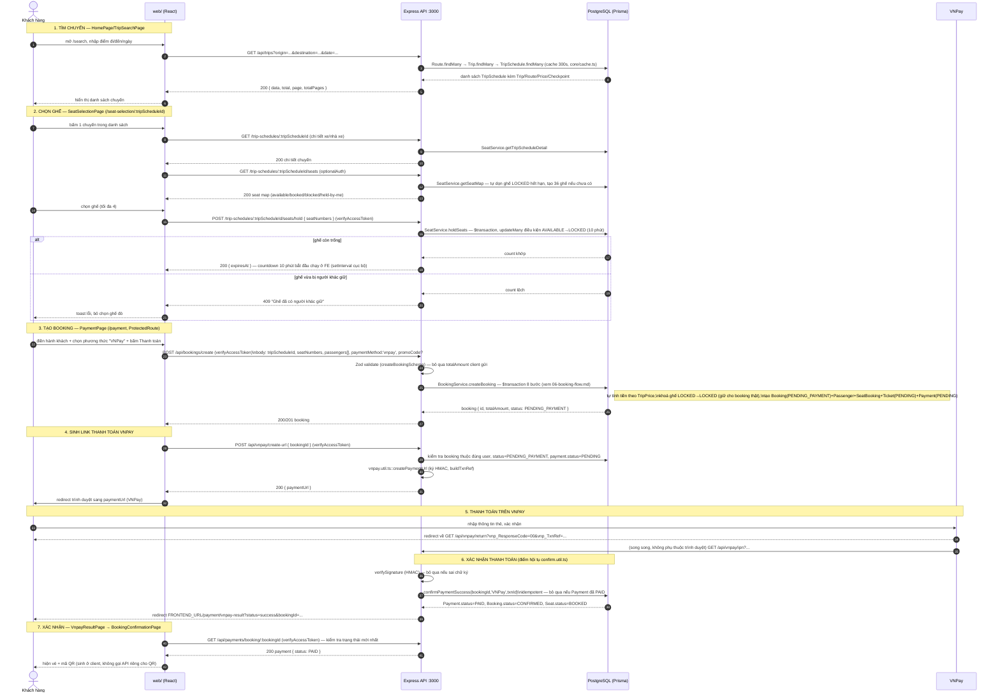
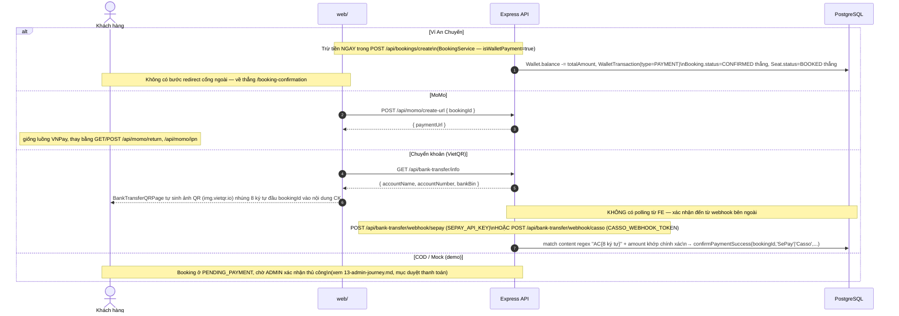
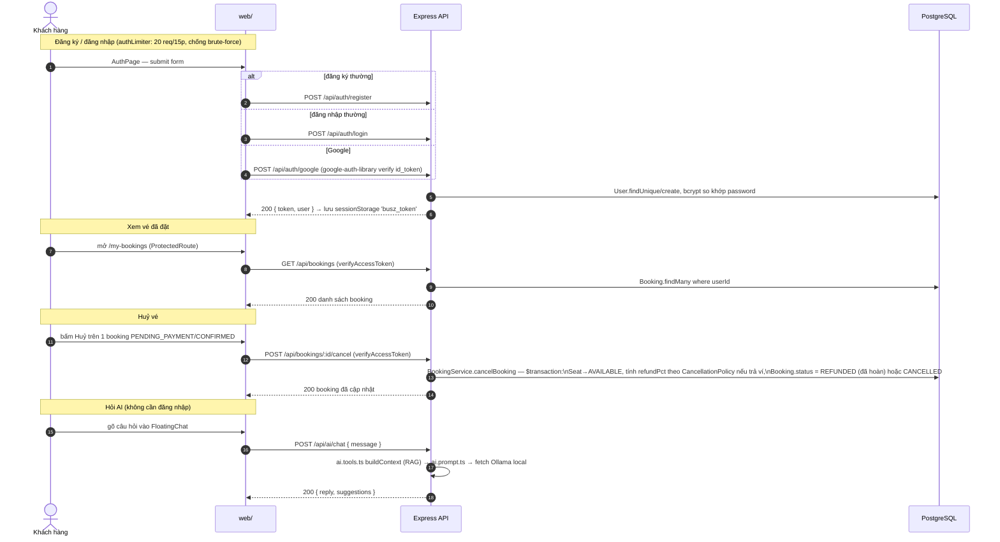

# 12 — User Journey (toàn bộ vòng đời 1 khách hàng, theo đúng thứ tự gọi API)

Nguồn: route thật trong `web/src/App.tsx`, endpoint thật trong `backend/src/index.ts` + `modules/*`. Mỗi bước dưới đây là 1 request thật — không có bước nào suy đoán.

Quy ước: mọi request đi qua chuỗi middleware toàn cục trước khi tới route handler (đã mô tả ở `03-backend-map.md`): `cors → helmet → compression → express.json → requestContextMiddleware → loggingMiddleware → apiLimiter (300/15p) → route`. Sơ đồ dưới đây lược bớt phần này để tập trung vào business logic, chỉ nhắc lại khi có middleware riêng (`verifyAccessToken`, `optionalAuth`, `authLimiter`).

## Toàn cảnh 1 lượt mua vé (happy path, thanh toán VNPay)

## Nhánh phương thức thanh toán khác (thay bước 4-6 ở trên)

## Các hành trình khác của user (ngoài mua vé)

## Ghi chú trình tự quan trọng (dễ hiểu sai nếu chỉ đọc code rời rạc)

1. **Hold ghế xảy ra TRƯỚC khi tạo Booking**, và là 2 lần khoá riêng biệt trên cùng bảng `Seat` — hold dùng `lockExpiresAt` (10 phút, tự dọn lazy), tạo Booking thì xoá `lockExpiresAt` đi (khoá không giới hạn thời gian theo kiểu hold nữa, mà theo `BOOKING_EXPIRY_MINUTES` ở tầng Booking).
2. **`/vnpay|momo/create-url` gọi SAU `/bookings/create`**, không phải trước — Payment record (`status: PENDING`) đã tồn tại từ bước tạo booking, route `create-url` chỉ kiểm tra lại rồi sinh URL.
3. **`GET /vnpay|momo/return` và `GET/POST .../ipn` có thể tới theo thứ tự bất kỳ, hoặc chỉ 1 trong 2 tới** (ví dụ chạy local không có domain public thì IPN không bao giờ gọi được) — vì vậy `confirmPaymentSuccess` phải idempotent, ai tới trước thắng, người tới sau nhận `alreadyProcessed: true`.
4. **Không có bước nào trong toàn bộ luồng gọi tới Socket.IO** — kể cả khi ghế vừa bị khoá/nhả, client khác không được thông báo chủ động (xem `10-realtime-flow.md`).
