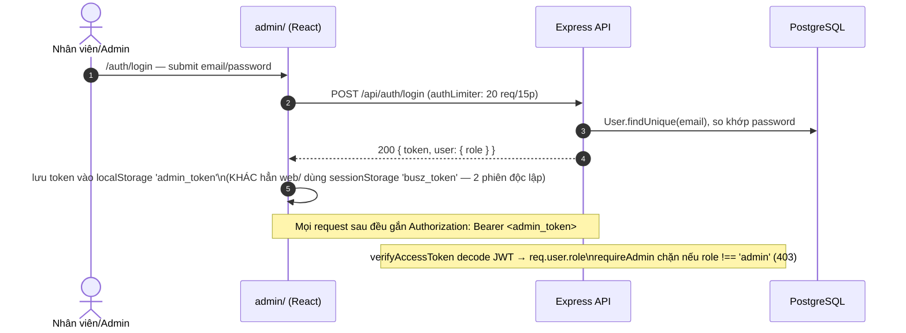
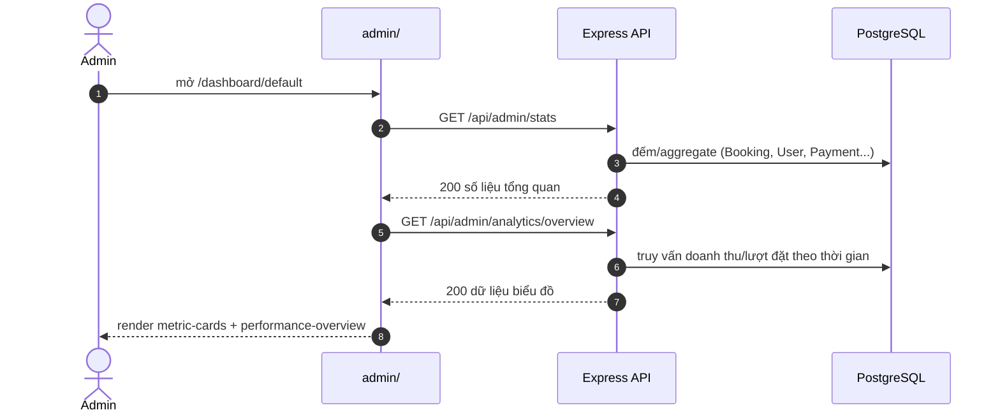
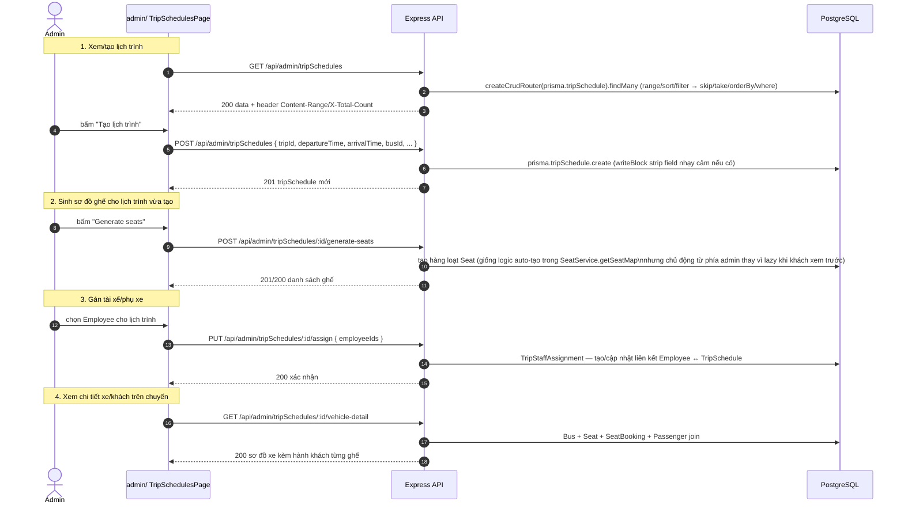
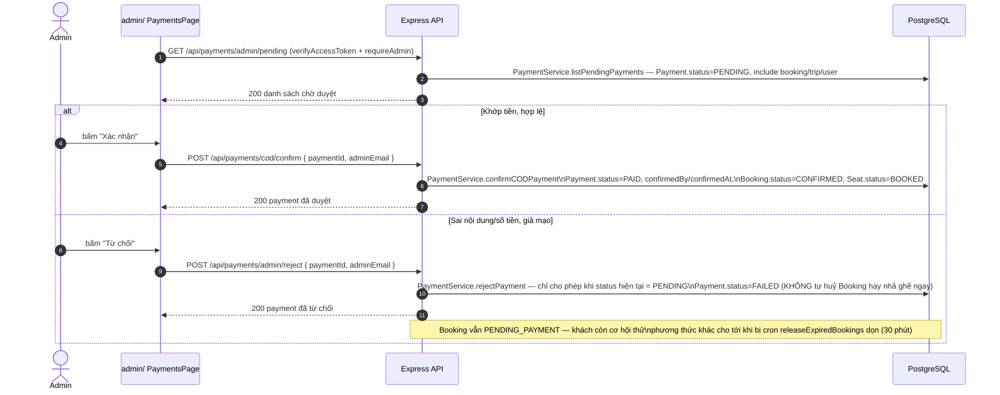
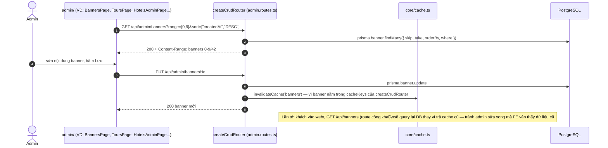
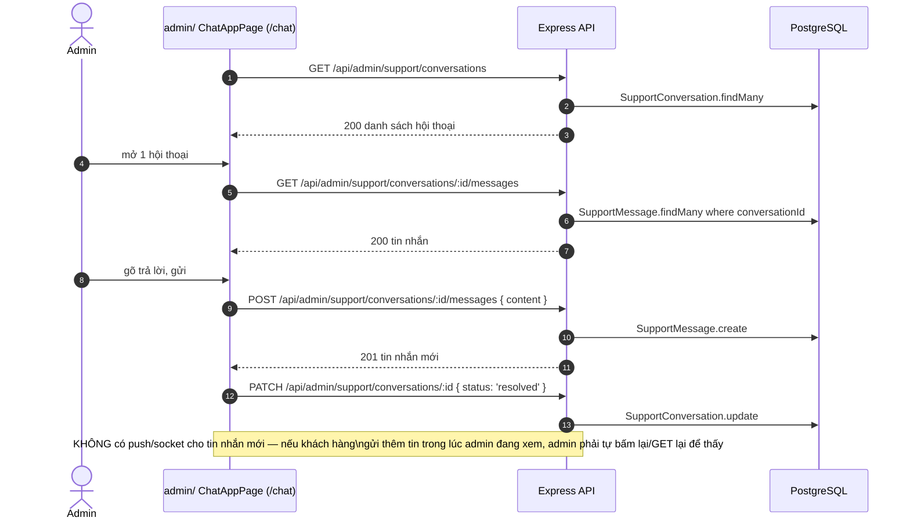

# 13 — Admin Journey (trình tự request thật khi vận hành hệ thống)

Nguồn: `admin/src/App.tsx`, `backend/src/admin.routes.ts` (toàn bộ sau `router.use(verifyAccessToken); router.use(requireAdmin);`), `payment.routes.ts`.

## Đăng nhập admin — khác cơ chế token với web/



## Trình tự request khi mở Dashboard mặc định



## Vận hành chuyến xe — tạo lịch trình, sinh ghế, phân công tài xế



## Duyệt thanh toán thủ công (COD / chuyển khoản không khớp webhook)



## Quản lý nội dung / dữ liệu tĩnh (áp dụng như nhau cho 20+ resource CRUD)



## Chat hỗ trợ khách hàng (REST — không realtime, xem `10-realtime-flow.md`)



## Bảng tổng hợp trình tự middleware cho MỌI request `/api/admin/*`

```text
cors → helmet → compression → express.json
  → requestContextMiddleware → loggingMiddleware → apiLimiter (300/15p, chung /api)
    → router.use(verifyAccessToken)   [401 nếu thiếu/sai token]
      → router.use(requireAdmin)      [403 nếu role !== 'admin']
        → route handler (custom hoặc createCrudRouter)
          → Prisma → PostgreSQL
        → deepStrip(password) trước khi trả JSON
      → errorMiddleware nếu có lỗi ném ra (luôn 500 — xem 11-error-edge-cases.md)
```
