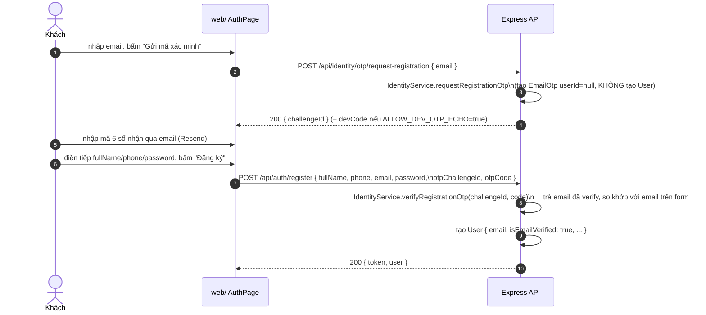
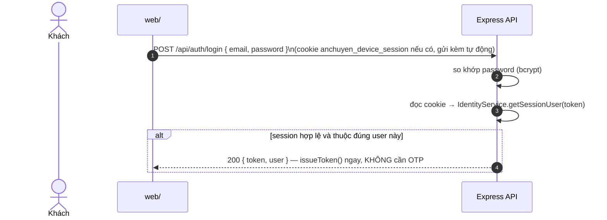

# 14 — Identity / OTP / Device Session (thêm ở commit `931302a`)

Nguồn: `backend/src/modules/identity/*`, `backend/src/middleware/{deviceSession,combined-auth,guestBookingIdentity}.middleware.ts`, `backend/src/auth.routes.ts`, `backend/src/core/{mailer,emailTemplates,audit,mask}.ts`, `backend/prisma/schema.prisma`.

## Vì sao có tính năng này

Trước commit này, đăng ký/đăng nhập chỉ cần email+password (không xác minh email thật, không phân biệt thiết bị lạ). `931302a` thêm 2 việc:
1. **Xác minh email bằng OTP khi đăng ký** — email chỉ được gắn vào `User` sau khi đã verify OTP.
2. **Yêu cầu OTP khi đăng nhập từ thiết bị chưa từng đăng nhập** ("thiết bị mới") — dựa vào cookie phiên thiết bị (`DeviceSession`), không phải fingerprint/IP.

## Model DB liên quan (`schema.prisma`)

| Model | Field chính | Vai trò |
|---|---|---|
| `EmailOtp` | `challengeId` (unique), `email`, `codeHash`, `userId?` (nullable — hỗ trợ OTP đăng ký khi CHƯA có User), `attempts`, `expiresAt`, `usedAt?` | 1 bản ghi = 1 lần xin mã |
| `DeviceSession` | `refreshToken` (unique, = giá trị cookie), `userId`, `deviceInfo?`, `ipAddress?`, `expiresAt` (60 ngày), `lastSeenAt`, `revokedAt?` | 1 bản ghi = 1 thiết bị đã tin cậy |
| `PasswordResetToken` | `tokenHash` (sha256, unique), `expiresAt`, `usedAt?` | quên mật khẩu (flow riêng, xem cuối file) |
| `User.isEmailVerified` | boolean | set `true` khi verify OTP đăng ký thành công |

## Luồng 1 — Đăng ký (verify email trước khi tạo tài khoản)



Bắt buộc phải có `otpChallengeId` + `otpCode` khớp mới cho tạo `User` — không còn đường nào đăng ký mà bỏ qua xác minh email.

## Luồng 2 — Đăng nhập, thiết bị đã tin cậy (happy path phổ biến)



## Luồng 3 — Đăng nhập từ thiết bị mới (chưa có cookie hợp lệ)

```mermaid
sequenceDiagram
    autonumber
    actor U as Khách
    participant W as web/
    participant API as Express API

    W->>API: POST /api/auth/login { email, password }
    API->>API: password đúng, nhưng cookie thiếu/không khớp user\n→ isTrustedDevice = false
    alt user có email
        API->>API: IdentityService.requestOtp(user.email)
        API-->>W: 200 { requiresOtp: true, challengeId, message, devCode? }\nKHÔNG cấp JWT
        W-->>U: hiện màn nhập OTP
        U->>W: nhập mã từ email
        W->>API: POST /api/auth/login/verify-otp { challengeId, code }
        API->>API: IdentityService.verifyOtp → tạo DeviceSession mới (60 ngày)
        API->>API: set cookie anchuyen_device_session; issueToken(user)
        API-->>W: 200 { token, user }
    else user không có email (tài khoản hiếm, chỉ có phone)
        API-->>W: 200 { token, user } — cho qua như hành vi cũ, không thể gửi OTP
    end
```

## Chống bị dò email tồn tại (user enumeration)

`requestOtp`/`requestRegistrationOtp` **luôn trả cùng 1 response** (`GENERIC_OTP_RESPONSE`) bất kể email đã tồn tại hay chưa, và việc gửi mail chạy fire-and-forget (không `await`, có `.catch(() => {})`) để thời gian phản hồi không tiết lộ email có tồn tại hay không.

## Giới hạn chống spam/brute-force OTP

| Cơ chế | Giá trị mặc định | Biến môi trường |
|---|---|---|
| Cooldown giữa 2 lần xin mã cùng email | 60 giây | `OTP_RESEND_COOLDOWN_SECONDS` |
| Số lần nhập sai tối đa / mã | 5 | `OTP_MAX_ATTEMPTS` |
| Hạn dùng mã | theo `OTP_TTL_MINUTES` | `OTP_TTL_MINUTES` |
| Rate-limit tầng route (`otpLimiter`) | 20 request / 15 phút / IP, áp cho toàn bộ `/api/identity/otp/*` và `/lookup-order` | — |
| Dev-only: trả thẳng mã OTP trong response | tắt mặc định | `ALLOW_DEV_OTP_ECHO=true` (chỉ khi `NODE_ENV=development`) |

## Middleware mới — dùng cho khách vãng lai (guest) đặt vé không cần tài khoản đầy đủ

| Middleware | File | Vai trò |
|---|---|---|
| `deviceSessionAuth` | `middleware/deviceSession.middleware.ts` | Đọc cookie `anchuyen_device_session` → gắn `req.identityUser` nếu hợp lệ. **Không bao giờ tự trả 401.** |
| `requireAnyIdentity` | `middleware/combined-auth.middleware.ts` | Chấp nhận `req.user` (JWT) **hoặc** `req.identityUser` (cookie); nếu có `identityUser` thì gán luôn vào `req.user` để controller cũ dùng lại được; thiếu cả 2 → 401 |
| `guestBookingIdentity` | `middleware/guestBookingIdentity.middleware.ts` | Chỉ ở `POST /bookings/create`: nếu chưa có identity nào và body có `contactEmail` → tự tạo/tìm `User` theo email, cấp `DeviceSession` **ngay lập tức, không cần OTP** (khách vãng lai lần đầu đặt vé) |

**Route đã gắn 3 middleware này** (grep xác nhận, không suy đoán):

- `booking.routes.ts` — `POST /create`: `[optionalAuth, deviceSessionAuth, guestBookingIdentity, requireAnyIdentity]`
- `seat.routes.ts` — `POST /:tripScheduleId/seats/hold` và `/release`: `[optionalAuth, deviceSessionAuth, requireAnyIdentity]`

Các module khác (payment, admin, wallet, loyalty...) **không đổi** — vẫn chỉ dùng `verifyAccessToken`/`optionalAuth`/`requireAdmin` như trước.

⚠️ **Admin (`admin/`) KHÔNG dùng cơ chế này** — `admin/src/lib/api.ts` vẫn xác thực thuần bằng JWT lưu ở `localStorage['admin_token']`, không đọc/ghi cookie `anchuyen_device_session`, không có OTP khi admin đăng nhập từ máy lạ.

## Email thật gửi qua Resend

`core/mailer.ts`: chỉ gửi thật khi `EMAIL_PROVIDER=resend` + có `RESEND_API_KEY`; thiếu thì chỉ log warning (không throw, không chặn flow). `EMAIL_FROM` mặc định `no-reply@anchuyen.vn`.

| Template | File | Khi nào gửi | Gọi từ |
|---|---|---|---|
| Mã OTP | `emailTemplates/otp.ts` | mỗi lần `requestOtp`/`requestRegistrationOtp` | `identity.service.ts` |
| Xác nhận đơn hàng | `emailTemplates/orderConfirmation.ts` | ngay sau khi tạo Booking (`PENDING_PAYMENT`) | `booking.email.ts::sendOrderConfirmationEmail`, gọi từ `booking.controller.ts` |
| Vé điện tử (kèm QR) | `emailTemplates/eTicket.ts` | sau khi Payment chuyển `PAID` | `booking.email.ts::sendETicketEmail`, gọi từ `confirm.util.ts` (VNPay/MoMo/webhook) và `payment.service.ts` (admin duyệt COD) |

Cả 3 nơi gọi mail đều bọc try/catch hoặc fire-and-forget — **gửi mail thất bại không làm hỏng transaction chính** (booking/OTP vẫn tạo thành công dù mail lỗi).

⚠️ **`[MISSING]` — chưa nhất quán**: `POST /api/auth/forgot-password` **chưa dùng Resend** dù hạ tầng mailer đã có sẵn từ tính năng OTP — vẫn chỉ trả `devResetLink` khi `ALLOW_DEV_RESET_LINK=true`, comment trong code tự thừa nhận "chưa có email provider, cần cấu hình trước production".

## Audit log (không phải bảng DB — chỉ log có cấu trúc)

`core/audit.ts::auditLog()` ghi qua `logger.info({category:'audit', ...})`, các event liên quan OTP: `OtpRequested`, `OtpVerified`, `OtpFailed`, `GuestSessionCreated`, `OrderLookupSucceeded/Failed`. Không có bảng `AuditLog` trong `schema.prisma` — log chỉ nằm trong stdout/log file, không truy vấn lại được qua Prisma.

## `core/mask.ts`

`maskIdCard()` che số CCCD/CMND (giữ 3 số đầu + 3 số cuối) khi trả dữ liệu qua CRUD admin — không áp dụng cho `GET/PUT /api/auth/profile` (người dùng tự xem hồ sơ mình thì thấy đầy đủ).

## Chưa có test

`backend/src/__tests__/` hiện chỉ có test cho `admin.auth`, `async-context`, `booking.service`, `seat.service`. **Không có test nào cho `identity.service.ts`, OTP flow, hay `DeviceSession` middleware** — toàn bộ tính năng ở file này chưa có coverage tự động.

## Endpoint mới cần bổ sung vào `04-api-map.md`

| Method | Path | Auth | Rate limit |
|---|---|---|---|
| POST | `/api/identity/otp/request` | công khai | `otpLimiter` (20/15p) |
| POST | `/api/identity/otp/request-registration` | công khai | `otpLimiter` |
| POST | `/api/identity/otp/request-admin` | công khai (chỉ gửi thật nếu email đã có role=admin) | `otpLimiter` |
| POST | `/api/identity/otp/verify` | công khai | `otpLimiter` |
| POST | `/api/identity/lookup-order` | công khai | `otpLimiter` |
| GET | `/api/identity/session` | cookie `anchuyen_device_session` | — |
| POST | `/api/identity/logout` | cookie | — |
| POST | `/api/auth/login/verify-otp` | công khai (cần `challengeId` hợp lệ) | `authLimiter` (mount chung `/api/auth`) |
